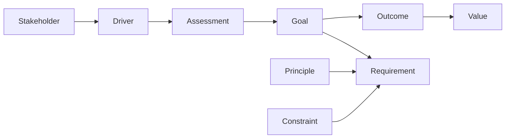
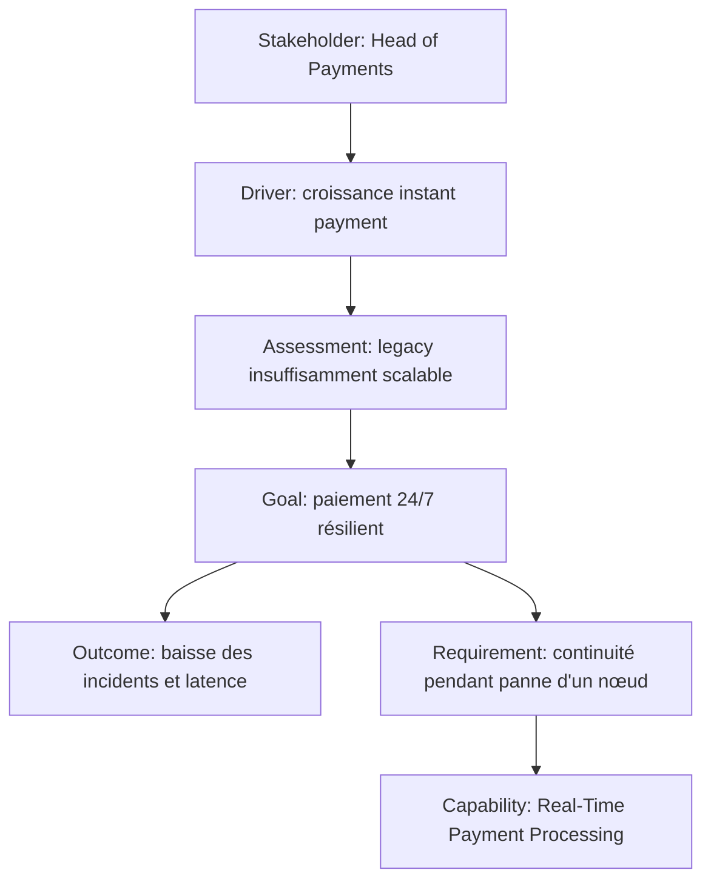

# Partie III — Motivation : du « pourquoi » à l’exigence

La couche **Motivation** sert à expliquer pourquoi une architecture existe, qui est concerné, quelles forces poussent au changement, comment la situation est évaluée, quels résultats sont recherchés et quelles règles ou exigences encadrent la transformation.

Elle répond à des questions comme :

- **Qui** a un intérêt dans l’architecture ? → `Stakeholder`
- **Qu’est-ce qui pousse au changement ?** → `Driver`
- **Que constatons-nous à propos de ce driver ?** → `Assessment`
- **Quel état voulons-nous atteindre ?** → `Goal`
- **Quel résultat observable voulons-nous obtenir ?** → `Outcome`
- **Quelle règle générale voulons-nous respecter ?** → `Principle`
- **Quelle propriété précise doit être satisfaite ?** → `Requirement`
- **Quelle limitation devons-nous respecter ?** → `Constraint`
- **Que signifie une information dans ce contexte ?** → `Meaning`
- **Quelle valeur lui attribue un stakeholder ?** → `Value`

---

## 1. La chaîne mentale Motivation



Ce schéma est pédagogique : il montre une chaîne de raisonnement fréquente. Il ne signifie pas que toutes ces relations sont obligatoires dans chaque modèle.

---

## 2. Exemple MayaBank

MayaBank veut moderniser les paiements instantanés.

### Stakeholders

- Head of Payments
- CISO
- Operations
- Customer Service
- Compliance

### Drivers

- hausse des volumes instant payment ;
- exigences de disponibilité 24/7 ;
- pression réglementaire ;
- coût des traitements manuels ;
- attentes clients de visibilité temps réel.

### Assessments

- la chaîne actuelle contient plusieurs traitements batch ;
- le suivi transactionnel est fragmenté ;
- le taux d’exception manuel est élevé ;
- la plateforme legacy augmente le risque opérationnel.

### Goals

- traiter les paiements en temps réel ;
- améliorer la résilience ;
- réduire les exceptions manuelles ;
- améliorer la traçabilité.

### Outcomes

- réduction mesurée du temps de traitement ;
- diminution du taux d’intervention manuelle ;
- augmentation de la disponibilité ;
- amélioration du taux de transactions traçables de bout en bout.

### Principles

- Security by Design ;
- Observable by Default ;
- Contract-First Integration ;
- Automation First.

### Requirements

- chaque paiement doit posséder un identifiant de corrélation de bout en bout ;
- chaque composant critique doit exposer métriques, logs et traces ;
- la migration doit permettre un rollback contrôlé.

### Constraints

- coexistence temporaire avec le legacy ;
- budget annuel plafonné ;
- fenêtre de migration limitée ;
- conservation de certaines interfaces partenaires pendant la transition.

---

## 3. Motivation n’est pas Strategy

La Motivation explique **pourquoi**.

La Strategy explique davantage **ce que l’entreprise doit être capable de faire et quelle direction elle choisit**.

Exemple :

```text
Driver      : croissance des paiements instantanés
Goal        : traiter 24/7 avec une forte résilience
Capability  : Real-Time Payment Processing
Course of Action : moderniser progressivement la plateforme
```

`Capability` n’est donc pas un élément Motivation mais Strategy.

---

## 4. Motivation n’est pas Business

Un `Goal` n’est pas un `Business Process`.

- `Goal` = état souhaité ;
- `Business Process` = comportement métier structuré.

Un `Requirement` n’est pas non plus un `Business Service`.

- `Requirement` = propriété nécessaire ;
- `Business Service` = comportement métier exposé.

---

## 5. Les confusions les plus importantes

| Confusion | Bonne distinction |
|---|---|
| Driver vs Goal | Driver pousse au changement ; Goal décrit l’état souhaité |
| Assessment vs Driver | Driver est la force ; Assessment est l’analyse de cette force |
| Goal vs Outcome | Goal = intention ; Outcome = résultat observable |
| Principle vs Requirement | Principle = règle générale ; Requirement = besoin/propriété spécifique |
| Requirement vs Constraint | Requirement exprime ce qui doit être vrai ; Constraint limite les solutions possibles |
| Meaning vs Value | Meaning = interprétation ; Value = importance/utilité perçue |
| Stakeholder vs Business Actor | Stakeholder = intérêt vis-à-vis de l’architecture ; Business Actor = entité capable d’exécuter un comportement métier |

---

## 6. Le bon niveau d’abstraction

Une vue Motivation doit rester orientée décision.

Mauvais exemple :

```text
Requirement: pod replicas = 7
Requirement: heap = 4 GiB
Requirement: timeout = 4800 ms
```

Ces choix peuvent être utiles dans une conception technique détaillée, mais ils sont souvent trop fins pour une vue Motivation d’entreprise.

Meilleur exemple :

```text
Requirement: la plateforme doit supporter une perte de nœud sans interruption du service critique.
```

Puis la Technology Architecture déterminera comment satisfaire cette exigence.

---

## 7. Pattern complet



La dernière relation vers `Capability` illustre le passage de Motivation vers Strategy : le besoin motive une aptitude que l’entreprise doit posséder.

---

## 8. Questions de contrôle

### Q1
Une nouvelle réglementation impose une vérification renforcée. Est-ce d’abord un Goal ou un Driver ?

**Réponse : Driver.** La réglementation est une force qui motive le changement.

### Q2
« Le système actuel ne permet pas de tracer 35 % des exceptions de bout en bout. »

**Réponse : Assessment.** C’est une évaluation de la situation.

### Q3
« Réduire les exceptions manuelles à moins de 2 %. »

**Réponse : selon la formulation et le contexte, cela peut être modélisé comme un Goal très mesurable ou comme un Outcome attendu. Pour éviter l’ambiguïté pédagogique : Goal = intention de réduction ; Outcome = résultat effectivement visé/mesurable.**

### Q4
« Toute intégration externe doit être contract-first. »

**Réponse : Principle.** Il s’agit d’une règle générale de conception.

### Q5
« Les données réglementaires doivent être conservées pendant la durée imposée. »

**Réponse : Requirement ou Constraint selon le point de vue.** Si l’accent porte sur la propriété à satisfaire, Requirement ; si l’accent porte sur la limitation imposée au design, Constraint. Le contexte de modélisation compte.

---

## À retenir

> **Motivation raconte le raisonnement qui justifie l’architecture.**

Un bon modèle ne commence pas par « nous allons déployer Kafka/OpenShift ». Il commence par les stakeholders, drivers, assessments, goals, outcomes et exigences qui expliquent pourquoi certaines capacités et solutions deviennent nécessaires.
