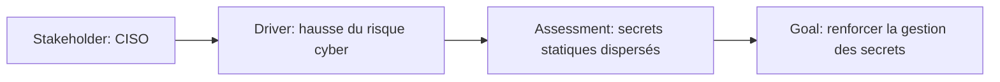
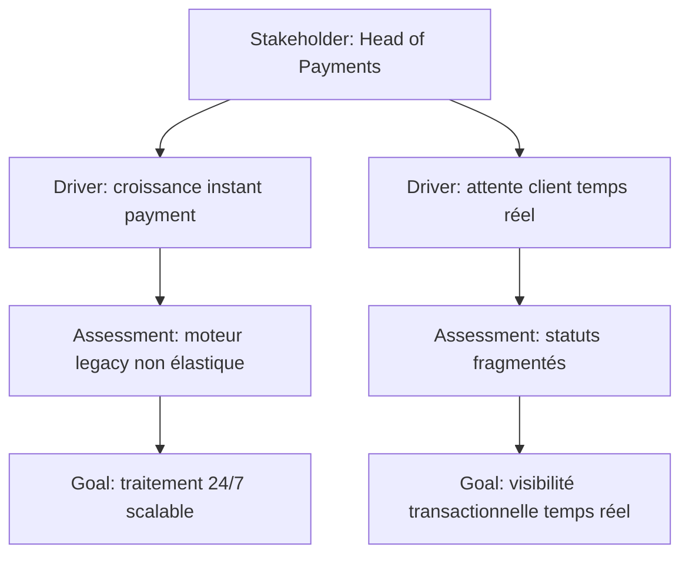

# Stakeholder, Driver et Assessment

Ces trois concepts forment souvent le début d’un raisonnement d’architecture.

- `Stakeholder` : qui a un intérêt dans les effets de l’architecture ?
- `Driver` : quelle force pousse à agir ?
- `Assessment` : que concluons-nous en analysant cette force et la situation actuelle ?

---

## 1. Stakeholder

Un **Stakeholder** représente le rôle d’un individu, d’une équipe ou d’une organisation qui possède un intérêt dans les effets de l’architecture.

Le mot important est **intérêt**.

Un Stakeholder n’est pas automatiquement quelqu’un qui exécute un processus métier.

### Exemples MayaBank

- Head of Payments
- CISO
- Head of Operations
- Compliance Officer
- Product Owner Instant Payments
- Customer Service Director

### Stakeholder vs Business Actor

`Business Actor` répond à :

> Qui exécute ou porte un comportement métier ?

`Stakeholder` répond à :

> Qui a un intérêt, une préoccupation ou une influence sur l’architecture ?

Une même personne réelle peut être représentée différemment selon le modèle.

Exemple :

- `Head of Payments` comme Stakeholder dans une vue Motivation ;
- `Payments Operations Team` comme Business Actor dans une vue Business.

### Mauvais réflexe

Créer un Stakeholder pour chaque utilisateur ou système.

ArchiMate n’est pas un annuaire. On modélise les stakeholders utiles à la décision d’architecture.

---

## 2. Driver

Un **Driver** représente une condition interne ou externe qui motive une organisation à définir des objectifs et à mettre en œuvre des changements.

### Drivers externes

- réglementation ;
- évolution d’un scheme de paiement ;
- cybermenace ;
- pression concurrentielle ;
- nouvelle technologie ;
- évolution du marché.

### Drivers internes

- dette technique ;
- coûts d’exploitation ;
- stratégie cloud ;
- mauvaise qualité de service ;
- besoin de simplification ;
- croissance des volumes.

### Driver vs Goal

Exemple :

```text
Driver: augmentation des volumes de paiement
Goal: supporter la croissance sans dégradation du service
```

Le Driver décrit la pression.
Le Goal décrit l’état souhaité.

### Driver vs Requirement

```text
Driver: nouvelle réglementation de traçabilité
Requirement: chaque transaction doit être traçable de bout en bout
```

Le premier explique **pourquoi**.
Le second indique **ce qui doit être satisfait**.

---

## 3. Assessment

Un **Assessment** représente le résultat d’une analyse de l’état de l’entreprise par rapport à un Driver.

C’est un concept extrêmement utile parce qu’il évite de passer directement du Driver au Goal sans expliciter le diagnostic.

### Exemple

```text
Driver: croissance du paiement instantané
Assessment: la plateforme actuelle atteint 75 % de sa capacité lors des pointes
Goal: augmenter la capacité et l’élasticité
```

### Autres Assessments MayaBank

- 18 % des exceptions nécessitent une intervention manuelle ;
- le monitoring ne permet pas une corrélation transactionnelle de bout en bout ;
- deux moteurs de paiement implémentent des règles redondantes ;
- le RTO réel dépasse la cible métier ;
- le coût d’exploitation augmente plus vite que les volumes.

### Assessment vs Requirement

`Assessment` décrit **ce que l’analyse révèle**.

`Requirement` décrit **ce qui doit être vrai**.

Exemple :

```text
Assessment: l’application legacy ne supporte pas la reprise automatique
Requirement: la cible doit permettre la reprise automatique après perte d’un nœud
```

---

## 4. Pattern de raisonnement



Ce pattern est utile pour raconter une décision d’architecture :

1. qui est concerné ;
2. quelle force pousse au changement ;
3. ce que l’analyse constate ;
4. ce que l’on cherche ensuite à obtenir.

---

## 5. Relations et prudence

Les relations de Motivation permettent d’exprimer notamment l’influence entre concepts.

Le point important pour l’apprentissage n’est pas de mémoriser une flèche isolée, mais de comprendre la sémantique :

- un stakeholder peut avoir des préoccupations ou intérêts liés à certains drivers ;
- un driver peut influencer des goals ;
- un assessment peut influencer la manière dont un driver ou un objectif est compris.

La relation `Influence` sera étudiée en profondeur dans la partie consacrée aux relations.

---

## 6. Use case : migration OpenShift

MayaBank envisage de migrer une plateforme Java legacy vers OpenShift.

### Mauvais modèle

```text
Goal → OpenShift
```

Trop direct.

### Modèle plus riche

```text
Stakeholder: Head of Operations
Driver: coûts d'exploitation et incidents récurrents
Assessment: déploiements manuels + faible élasticité + MTTR élevé
Goal: exploitation plus automatisée et résiliente
Requirement: déploiement reproductible et rollback automatisé
Capability: Cloud-Native Application Delivery
```

Le choix OpenShift viendra plus tard comme élément de réalisation technologique.

---

## 7. Use case : paiement instantané



---

## 8. Pièges d’examen et de modélisation

### Piège 1 — Stakeholder = utilisateur

Faux. Un utilisateur peut être un stakeholder, mais le concept est plus large.

### Piège 2 — Driver = objectif

Faux. Le Driver pousse au changement ; le Goal décrit l’intention ou l’état souhaité.

### Piège 3 — Assessment = métrique brute

Pas forcément. Une métrique peut alimenter l’analyse, mais l’Assessment représente le résultat interprété de l’analyse.

### Piège 4 — Tout modéliser

Une vue Motivation ne doit pas contenir tous les stakeholders et drivers possibles. Elle doit montrer ceux qui expliquent la décision étudiée.

---

## 9. Questions / réponses

### Q1
« DORA impose une nouvelle exigence de résilience. » Quel concept représente le mieux l’impulsion initiale ?

**Driver.**

### Q2
« Les tests montrent que le PRA dépasse de 2 heures le RTO métier. »

**Assessment.**

### Q3
« Le responsable conformité veut réduire le risque de non-conformité. » Est-il nécessairement Business Actor ?

**Non.** Dans une vue Motivation il peut être Stakeholder parce que l’on modélise son intérêt dans l’architecture.

### Q4
Pourquoi ne pas modéliser directement `Driver → Technology Node` ?

**Parce que cela saute les niveaux de raisonnement.** Une architecture claire explicite généralement les goals, requirements, capabilities ou comportements qui justifient ensuite la solution technique.

---

## À retenir

> **Stakeholder = qui est concerné ; Driver = ce qui pousse ; Assessment = ce que l’analyse conclut.**

Ces trois concepts donnent un contexte rationnel avant de définir objectifs, exigences et solutions.
