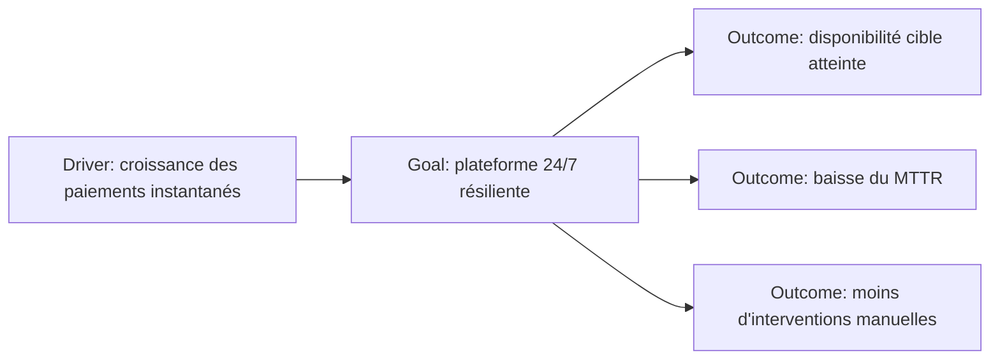

# Goal et Outcome

`Goal` et `Outcome` sont proches, mais ils ne jouent pas exactement le même rôle.

- `Goal` exprime un état souhaité ou une intention à atteindre.
- `Outcome` exprime un résultat final observable produit par la réalisation d’un comportement ou d’une transformation.

La différence est essentielle pour éviter de transformer toutes les ambitions en listes de KPI ou, inversement, de rester trop abstrait.

---

## 1. Goal

Un **Goal** décrit un état souhaité que l’organisation ou un stakeholder cherche à atteindre.

Exemples MayaBank :

- améliorer la résilience des paiements ;
- réduire les traitements manuels ;
- accélérer l’onboarding des partenaires ;
- améliorer la traçabilité ;
- réduire la dépendance au legacy.

Un Goal peut être stratégique ou plus ciblé.

### Goal vs Driver

```text
Driver: croissance des volumes instant payment
Goal: supporter la croissance avec une architecture résiliente et scalable
```

### Goal vs Requirement

```text
Goal: améliorer la traçabilité
Requirement: chaque transaction doit posséder un correlation ID propagé de bout en bout
```

Le Goal exprime l’intention.
Le Requirement traduit cette intention en propriété plus précise.

---

## 2. Outcome

Un **Outcome** représente un résultat final observable.

Il est souvent plus concret qu’un Goal et permet de montrer ce que la transformation produit réellement pour un stakeholder.

Exemples :

- disponibilité du service critique portée à la cible contractuelle ;
- réduction mesurée du taux d’exception manuel ;
- baisse du MTTR ;
- réduction du délai d’onboarding partenaire ;
- amélioration du taux de transactions traçables de bout en bout.

### Outcome vs KPI

ArchiMate n’est pas un outil de performance management détaillé.

Un Outcome peut être associé à une mesure ou un indicateur dans la documentation, mais il reste un concept d’architecture décrivant un résultat.

---

## 3. Goal vs Outcome

| Goal | Outcome |
|---|---|
| état souhaité | résultat final observable |
| intention | effet obtenu/attendu |
| souvent formulé qualitativement | souvent plus concret et mesurable |
| peut guider plusieurs transformations | peut exprimer un résultat spécifique d’une transformation |

Exemple simple :

```text
Goal: réduire les exceptions manuelles
Outcome: taux d'exception manuelle inférieur à 2 % sur le périmètre cible
```

---

## 4. Pourquoi distinguer les deux ?

Sans distinction :

```text
Goal: améliorer la résilience
Goal: 99,99 % de disponibilité
Goal: réduction de 40 % du MTTR
Goal: zéro intervention manuelle
```

Tout devient Goal.

Avec une structure plus propre :

```text
Goal: améliorer la résilience opérationnelle
Outcome: disponibilité cible atteinte
Outcome: MTTR réduit de 40 %
Outcome: reprise automatisée sur les incidents ciblés
```

Le modèle raconte mieux le passage de l’intention aux effets recherchés.

---

## 5. MayaBank : paiement instantané



---

## 6. Use case : onboarding partenaire

### Contexte

Ajouter un nouveau partenaire nécessite actuellement huit semaines et plusieurs configurations manuelles.

### Modèle Motivation

```text
Driver: pression business pour accélérer les partenariats
Assessment: onboarding moyen = 8 semaines
Goal: réduire le délai d’onboarding
Outcome: partenaire standard onboardé en moins de 10 jours
```

Le Goal donne la direction.
L’Outcome donne un résultat attendu qui permet de juger la transformation.

---

## 7. Use case : Green IT

```text
Driver: objectifs de sobriété numérique
Assessment: plateforme actuelle surdimensionnée et peu mesurée
Goal: réduire l'empreinte des workloads
Outcome: baisse mesurée des ressources consommées à service équivalent
```

La valeur d’ArchiMate est de pouvoir ensuite relier ce Goal à :

- des Requirements ;
- des Capabilities ;
- des Work Packages ;
- des éléments technologiques.

---

## 8. Pièges

### Piège — Transformer Outcome en Requirement

« Le système doit journaliser chaque transaction » = Requirement.

« 100 % des transactions sont traçables » = Outcome possible.

### Piège — Transformer Goal en Solution

« Migrer vers OpenShift » n’est pas automatiquement un Goal d’entreprise.

Il s’agit souvent d’un choix de solution ou d’une direction de transformation. Le vrai Goal peut être :

> améliorer la résilience, l’automatisation et la vitesse de livraison.

### Piège — Multiplier les Outcomes sans stakeholders

Un Outcome est intéressant parce qu’il a de la valeur pour des stakeholders.

Exemple :

- baisse MTTR → Operations ;
- meilleure visibilité → Customer Service ;
- réduction du risque → CISO / Risk ;
- onboarding plus rapide → Business Development.

---

## 9. Questions / réponses

### Q1
« Améliorer l’expérience client. »

**Goal** dans la plupart des modèles.

### Q2
« Le client reçoit son statut de paiement en moins de 5 secondes dans 99 % des cas. »

**Outcome** est souvent le meilleur choix si l’on décrit le résultat attendu.

### Q3
« Le système doit publier un événement de statut. »

**Requirement**, pas Outcome.

### Q4
Pourquoi un Outcome est-il utile en architecture d’entreprise ?

Parce qu’il permet de relier la transformation à un résultat observable, donc à la valeur attendue pour les stakeholders.

---

## À retenir

> **Goal = où voulons-nous aller ? Outcome = quel résultat concret voulons-nous observer ?**

Un bon modèle Motivation garde le Goal suffisamment stable pour guider la transformation et utilise les Outcomes pour expliciter les effets attendus.
