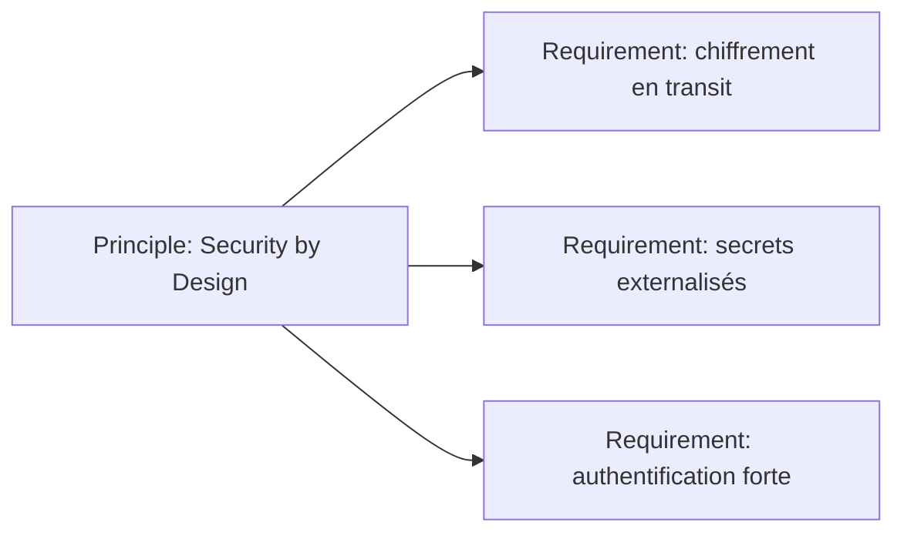
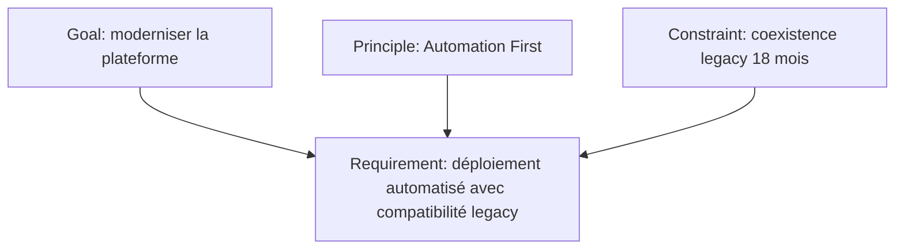

# Principle, Requirement et Constraint

Ces trois concepts expriment des règles ou besoins, mais à des niveaux différents.

- `Principle` : une intention ou règle générale qui guide les choix.
- `Requirement` : une propriété nécessaire à satisfaire.
- `Constraint` : un facteur qui limite l’espace des solutions possibles.

---

## 1. Principle

Un **Principle** exprime une règle générale qui s’applique dans un contexte donné.

Exemples MayaBank :

- Security by Design
- Observable by Default
- Automation First
- Contract-First Integration
- Reuse Before Build
- Data Ownership

### Ce qu’un Principle n’est pas

Un Principle n’est pas :

- une configuration technique ;
- une exigence ponctuelle ;
- une préférence personnelle ;
- un nom de produit.

Mauvais exemple :

```text
Principle: utiliser Kafka 4.x
```

Meilleur exemple :

```text
Principle: privilégier les échanges découplés lorsque le besoin ne requiert pas une réponse synchrone immédiate.
```

Le choix d’une technologie viendra ensuite.

---

## 2. Requirement

Un **Requirement** exprime une propriété nécessaire d’un système, d’une architecture ou d’une solution.

Exemples :

- chaque paiement doit être traçable de bout en bout ;
- les composants critiques doivent supporter le chiffrement en transit ;
- le service doit rester disponible pendant la perte d’un nœud ;
- le déploiement doit être reproductible ;
- la migration doit permettre un rollback contrôlé.

### Requirement vs Goal

```text
Goal: améliorer la résilience
Requirement: la cible doit tolérer la perte d'un nœud sans interruption du service critique
```

### Requirement vs Principle

```text
Principle: Observable by Default
Requirement: chaque composant critique doit exposer logs, métriques et traces corrélables
```

Le Principle guide.
Le Requirement précise ce qu’il faut satisfaire.

---

## 3. Constraint

Un **Constraint** représente un facteur qui limite la réalisation des objectifs ou la conception de la solution.

Exemples :

- budget maximal ;
- délai réglementaire ;
- technologie imposée pour une période de coexistence ;
- localisation des données ;
- contrat fournisseur non résiliable avant une date ;
- maintien temporaire d’une interface legacy.

### Constraint vs Requirement

La distinction dépend parfois de la manière dont la réalité est formulée.

Exemple :

```text
Requirement: les données réglementées doivent rester dans l'Union européenne
Constraint: la solution ne peut utiliser que des régions cloud approuvées dans l'Union européenne
```

Le premier exprime une propriété nécessaire.
Le second restreint l’espace de conception.

---

## 4. Pattern : du Principle au Requirement



Un Principle peut donc inspirer plusieurs Requirements concrets.

---

## 5. Pattern avec Constraint



Le Requirement est le point où plusieurs influences se rencontrent.

---

## 6. Use case : OpenShift

### Mauvais modèle

```text
Goal: utiliser OpenShift
Requirement: utiliser OpenShift
Principle: utiliser OpenShift
```

Même idée répétée sous trois concepts.

### Modèle plus propre

```text
Driver: coûts et lenteur des déploiements
Assessment: déploiements manuels et faible portabilité
Goal: industrialiser l'exploitation applicative
Principle: Automation First
Requirement: déploiement déclaratif et reproductible
Constraint: plateforme cible homologuée par l'entreprise
```

OpenShift pourra ensuite apparaître comme élément de réalisation technologique.

---

## 7. Use case : sécurité des API

```text
Principle: Zero Trust
Requirement: chaque appel inter-service doit être authentifié et autorisé
Requirement: les secrets ne doivent pas être stockés dans le code source
Constraint: intégration obligatoire avec l'IAM groupe
```

Cette structure est beaucoup plus expressive que :

```text
IAM → API → Security
```

---

## 8. Requirement ArchiMate vs Requirements Management TOGAF

Il faut absolument distinguer les deux.

### ArchiMate Requirement

C’est **un élément du modèle**.

### TOGAF Requirements Management

C’est **une activité continue de gestion, traçabilité, analyse et évolution des exigences** au travers de l’ADM.

Ils peuvent travailler ensemble : une exigence gérée dans le processus TOGAF peut être représentée comme `Requirement` dans un modèle ArchiMate.

Mais les concepts ne sont pas équivalents.

---

## 9. Traçabilité

Une chaîne utile :

```text
Principle
  ↓
Requirement
  ↓
Capability / Behavior / Service
  ↓
Application / Technology realization
```

Exemple :

```text
Observable by Default
→ transaction traceable end-to-end
→ Payment Monitoring Capability
→ Observability Application Service
→ Telemetry Platform
```

Cette continuité permet d’expliquer pourquoi un composant technique existe.

---

## 10. Pièges

### Piège 1 — Principle trop technique

Un Principle doit rester suffisamment général pour guider plusieurs décisions.

### Piège 2 — Requirement trop vague

« Le système doit être moderne » n’est pas une bonne exigence.

### Piège 3 — Constraint utilisée comme excuse

Une contrainte doit être réelle et explicite, pas une préférence cachée.

### Piège 4 — Confondre obligation et moyen

« Le service doit être hautement disponible » = besoin.

« Il faut trois replicas » = décision de réalisation possible.

---

## 11. Questions / réponses

### Q1
« Toute nouvelle API doit être versionnée et documentée par contrat. »

**Principle** si c’est une règle générale d’architecture.

### Q2
« Cette API doit rester compatible avec la version partenaire jusqu’en 2028. »

**Requirement** ou **Constraint** selon la vue ; Constraint est souvent naturel si l’on insiste sur la limitation de migration.

### Q3
« Aucun secret ne doit apparaître dans Git. »

**Requirement** précis dérivé d’un principe de sécurité.

### Q4
« Le projet ne dispose que de 12 mois avant une échéance réglementaire. »

**Constraint.**

### Q5
Pourquoi éviter de mettre un produit dans un Principle ?

Parce qu’un Principle exprime une règle générale et durable, tandis qu’un produit est un moyen de réalisation susceptible de changer.

---

## À retenir

> **Principle = règle directrice ; Requirement = propriété à satisfaire ; Constraint = limite à respecter.**

Cette triade permet de garder une architecture traçable sans mélanger intention, besoin et solution.
