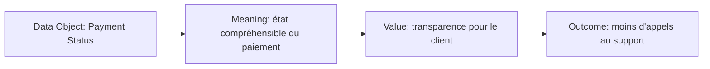

# Meaning et Value

`Meaning` et `Value` sont souvent moins utilisés que Goal ou Requirement, mais ils sont très utiles lorsqu’une architecture doit expliquer **comment une information est interprétée** et **pourquoi quelque chose compte pour un stakeholder**.

- `Meaning` : interprétation ou connaissance attribuée à un concept dans un contexte.
- `Value` : importance, utilité ou valeur relative attribuée à un concept.

---

## 1. Meaning

Un **Meaning** capture ce que quelque chose signifie pour une audience ou dans un contexte donné.

Exemple :

Un même statut technique `ACSP` peut être incompréhensible pour un client.

Dans une vue orientée expérience :

```text
Representation: Payment Status Message
Meaning: paiement accepté et en cours de traitement
```

Le Meaning sert donc à exprimer la signification interprétée, pas le stockage physique de l’information.

### Meaning vs Data Object

`Data Object` représente des données structurées pour traitement automatisé.

`Meaning` représente l’interprétation.

```text
Data Object: PaymentStatus
Meaning: état courant du paiement pour le client
```

### Meaning vs Business Object

`Business Object` représente un concept métier passif.

`Meaning` décrit l’interprétation ou la connaissance associée.

---

## 2. Value

Un **Value** représente la valeur, l’utilité ou l’importance relative d’un concept pour un stakeholder.

Exemples MayaBank :

- confiance client ;
- réduction du risque opérationnel ;
- rapidité de traitement ;
- conformité ;
- réduction des coûts ;
- meilleure visibilité ;
- time-to-market.

### Value n’est pas nécessairement financier

La valeur peut être :

- économique ;
- opérationnelle ;
- réglementaire ;
- stratégique ;
- réputationnelle ;
- liée à l’expérience utilisateur.

---

## 3. Value vs Outcome

```text
Outcome: réduction du délai d'onboarding partenaire
Value: accélération du time-to-market
```

L’Outcome décrit le résultat.
Le Value décrit ce que ce résultat vaut pour un stakeholder.

Autre exemple :

```text
Outcome: traçabilité complète des paiements
Value: réduction du risque opérationnel et amélioration du support client
```

---

## 4. Value vs Goal

```text
Goal: améliorer la visibilité transactionnelle
Value: confiance client et efficacité du support
```

Le Goal indique la direction.
Le Value indique pourquoi ce résultat est important.

---

## 5. MayaBank : statuts de paiement

### Contexte

Les statuts de paiement proviennent de plusieurs systèmes et utilisent des codes différents.

### Modèle



Ce modèle pédagogique montre comment une donnée technique peut être reliée à une signification et à une valeur métier.

---

## 6. Use case : observabilité

Une plateforme de traces distribuées n’a pas de valeur en soi uniquement parce qu’elle existe.

On peut raconter :

```text
Telemetry Data
→ Meaning: parcours complet d'une transaction
→ Value: diagnostic rapide
→ Outcome: baisse du MTTR
```

Cette chaîne aide à éviter les architectures centrées sur l’outil.

---

## 7. Use case : sécurité

```text
Outcome: réduction des secrets statiques
Value: réduction du risque cyber
```

Le Value explique l’importance du résultat pour le CISO ou Risk Management.

---

## 8. Questions / réponses

### Q1
« Ce code signifie que le paiement a été accepté par le scheme. »

**Meaning.**

### Q2
« Cette fonctionnalité améliore la confiance client. »

**Value.**

### Q3
« Le délai moyen passe de 8 semaines à 10 jours. »

**Outcome** est plus naturel si l’on décrit le résultat mesuré.

### Q4
Pourquoi Value n’est-il pas forcément un montant financier ?

Parce qu’ArchiMate utilise Value pour exprimer l’importance ou l’utilité relative d’un concept, y compris des bénéfices non financiers.

---

## À retenir

> **Meaning = ce que cela signifie ; Value = pourquoi cela compte.**

Ces concepts rendent les modèles plus utiles lorsqu’on veut relier information, résultats et intérêts des stakeholders.
