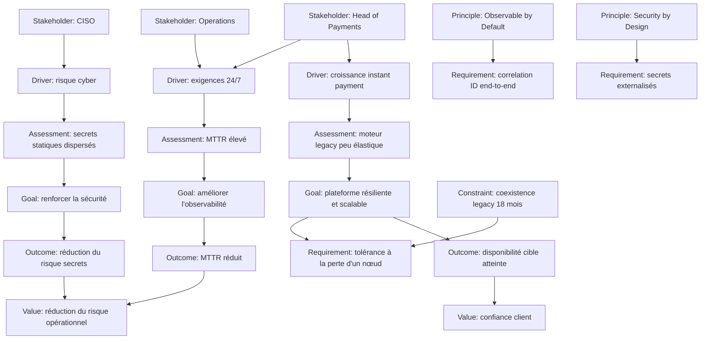

# Motivation — modèle complet MayaBank

Ce chapitre assemble les dix concepts Motivation dans un même raisonnement cohérent.

---

## 1. Contexte

MayaBank modernise sa chaîne de paiement instantané.

Les symptômes sont connus :

- volumes en hausse ;
- services 24/7 ;
- dépendance legacy ;
- visibilité transactionnelle insuffisante ;
- incidents difficiles à diagnostiquer ;
- forte intervention manuelle ;
- pression réglementaire et cyber.

---

## 2. Modèle Motivation complet



Ce diagramme est une vue pédagogique. Un modèle réel peut choisir des relations plus précises et ne doit afficher que ce qui est utile à l’audience.

---

## 3. Lire cette vue comme un architecte

### Étape 1 — Identifier les stakeholders

Qui porte les concerns ?

- Payments : capacité, continuité, time-to-market ;
- CISO : risque cyber ;
- Operations : disponibilité, diagnostic, reprise.

### Étape 2 — Identifier les drivers

Quelles forces rendent le statu quo insuffisant ?

### Étape 3 — Lire les assessments

Que révèle l’analyse actuelle ?

Les assessments transforment des forces générales en constats utilisables pour la décision.

### Étape 4 — Lire goals et outcomes

Que veut-on atteindre, puis quel résultat observable démontrera que l’on progresse ?

### Étape 5 — Lire principes, requirements et constraints

Quelles règles guident la conception ?
Quelles propriétés doivent être satisfaites ?
Quelles limites restreignent les choix ?

### Étape 6 — Lire la value

Pourquoi les résultats ont-ils de l’importance pour les stakeholders ?

---

## 4. Passage vers Strategy

Le modèle Motivation ne dit pas encore comment l’entreprise doit être structurée pour atteindre ces objectifs.

On peut maintenant introduire des Capabilities :

```text
Goal: plateforme résiliente et scalable
→ Capability: Real-Time Payment Processing
→ Capability: Resilience Engineering

Goal: améliorer l'observabilité
→ Capability: End-to-End Transaction Observability

Goal: renforcer la sécurité
→ Capability: Secrets & Identity Management
```

C’est le passage naturel vers la partie Strategy.

---

## 5. Passage vers Business

Les Capabilities seront ensuite réalisées ou supportées par des comportements métier.

Exemple :

```text
Capability: Real-Time Payment Processing
→ Business Process: Execute Instant Payment
→ Business Service: Instant Payment Service
```

---

## 6. Passage vers Application

```text
Business Process: Execute Instant Payment
→ Application Service: Payment Orchestration
→ Application Component: Payment Orchestrator
```

---

## 7. Passage vers Technology

```text
Application Component: Payment Orchestrator
→ Technology Service: Container Execution
→ Node: OpenShift Worker
```

La chaîne complète devient donc :

```text
WHY
Motivation
↓
WHAT WE MUST BE ABLE TO DO
Strategy
↓
WHAT THE BUSINESS DOES
Business
↓
HOW APPLICATIONS SUPPORT IT
Application
↓
WHERE IT RUNS
Technology
```

---

## 8. Anti-pattern : commencer par la solution

Mauvais récit :

```text
Nous allons installer OpenShift, Kafka et une stack d'observabilité.
```

Il manque :

- pour quels stakeholders ;
- face à quels drivers ;
- après quels assessments ;
- pour quels goals ;
- afin d’obtenir quels outcomes ;
- sous quels principles, requirements et constraints.

Meilleur récit :

```text
La croissance des paiements instantanés et les exigences 24/7 exposent les limites de la plateforme legacy.
Le diagnostic montre un manque d'élasticité, un MTTR élevé et une faible traçabilité.
L'objectif est une plateforme résiliente, observable et sécurisée.
Les exigences de continuité, de corrélation et de gestion des secrets déterminent les capabilities puis les choix de réalisation.
```

La technologie devient une conséquence du raisonnement d’architecture.

---

## 9. Exercice : fraude temps réel

### Contexte

Les paiements frauduleux augmentent et les contrôles actuels sont trop tardifs.

### À modéliser

Proposez :

- 2 Stakeholders ;
- 2 Drivers ;
- 2 Assessments ;
- 2 Goals ;
- 2 Outcomes ;
- 1 Principle ;
- 3 Requirements ;
- 1 Constraint ;
- 2 Values.

### Correction possible

**Stakeholders**
- Head of Fraud
- CISO

**Drivers**
- hausse des tentatives de fraude
- pression réglementaire

**Assessments**
- scoring réalisé trop tard dans le cycle
- données fraude fragmentées

**Goals**
- détecter le risque avant autorisation
- réduire les faux positifs

**Outcomes**
- baisse du taux de fraude
- baisse des paiements légitimes bloqués

**Principle**
- Risk Decision as Early as Possible

**Requirements**
- score disponible avant décision de paiement
- décision traçable
- règles versionnées

**Constraint**
- budget de latence limité pour le scoring

**Values**
- réduction des pertes
- confiance client

---

## 10. Questions de synthèse

### Q1
Quel élément explique le mieux une pression qui pousse au changement ?

**Driver.**

### Q2
Quel élément capture le diagnostic résultant d’une analyse ?

**Assessment.**

### Q3
Quel élément exprime une règle générale d’architecture ?

**Principle.**

### Q4
Quel élément représente une propriété précise à satisfaire ?

**Requirement.**

### Q5
Quel élément représente un bénéfice ou une importance pour un stakeholder ?

**Value.**

### Q6
Pourquoi la Motivation est-elle utile avant une Capability Map ?

Parce qu’elle explique pourquoi certaines capabilities doivent exister ou évoluer.

---

## À retenir

> **Une bonne vue Motivation raconte une décision avant de raconter une solution.**

Le modélisateur doit pouvoir lire la vue et répondre : qui est concerné, pourquoi le changement est nécessaire, quel diagnostic a été posé, quels résultats sont recherchés, quelles règles et limites encadrent la transformation et quelle valeur les stakeholders en attendent.
