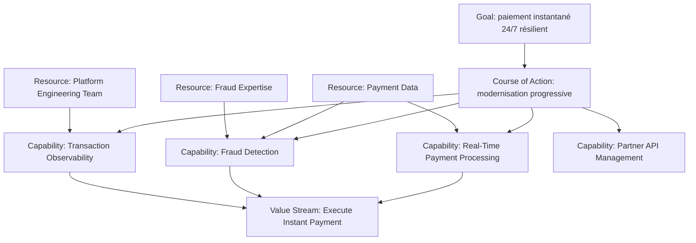

# Partie IV — Strategy : capabilities, ressources, valeur et direction

La couche **Strategy** relie les intentions de l’entreprise à ce qu’elle doit être capable de faire pour atteindre ses objectifs.

Elle contient quatre concepts majeurs :

- `Resource`
- `Capability`
- `Value Stream`
- `Course of Action`

Ces concepts sont peu nombreux, mais ils structurent une grande partie de l’architecture d’entreprise moderne.

---

## 1. La chaîne mentale Strategy

```text
WHY CHANGE?
Motivation
↓
WHAT MUST THE ENTERPRISE BE ABLE TO DO?
Capability
↓
WITH WHAT ASSETS?
Resource
↓
HOW IS VALUE CREATED?
Value Stream
↓
WHAT DIRECTION OR APPROACH WILL WE TAKE?
Course of Action
```

Cette chaîne est pédagogique. Les quatre concepts ne forment pas une séquence obligatoire.

---

## 2. Les quatre concepts

### Resource

Un actif possédé ou contrôlé par une organisation ou une personne.

Exemples :

- Payment Data ;
- Fraud Expertise ;
- Partner Network ;
- Cloud Platform Team ;
- Customer Relationship Data.

### Capability

Une aptitude qu’un élément de structure active possède.

Exemples :

- Real-Time Payment Processing ;
- Fraud Detection ;
- API Partner Onboarding ;
- Resilience Engineering ;
- Transaction Observability.

### Value Stream

Une séquence d’étapes créant un résultat global de valeur pour un client, stakeholder ou utilisateur final.

Exemple :

```text
Initiate Payment
→ Validate
→ Assess Risk
→ Execute
→ Confirm
→ Resolve Exception
```

### Course of Action

Une approche ou direction choisie pour configurer les capabilities et resources afin d’atteindre un goal.

Exemples :

- moderniser progressivement la plateforme ;
- API-first ;
- event-driven where appropriate ;
- cloud-first for eligible workloads ;
- automate operational controls.

---

## 3. Capability n’est pas Application

C’est l’une des confusions les plus importantes.

```text
Capability: Real-Time Payment Processing
Application Component: Payment Orchestrator
```

La capability reste pertinente même si le composant applicatif change.

Une capability exprime **ce que l’organisation sait faire**.
Une application exprime **un moyen de réalisation**.

---

## 4. Capability n’est pas Business Process

```text
Capability: Fraud Detection
Business Process: Assess Payment Risk
```

La capability décrit une aptitude.
Le process décrit un comportement structuré qui se déroule.

Une capability est généralement plus stable que les processus qui la réalisent.

---

## 5. Value Stream n’est pas Business Process

Un Value Stream est orienté **création de valeur**.

Un Business Process est orienté **enchaînement de comportements métier**.

Exemple :

```text
Value Stream Stage: Validate Payment
Business Processes:
- Validate Payment Format
- Check Customer Eligibility
- Check Payment Limits
```

Un stage peut être réalisé par plusieurs processus.

---

## 6. Course of Action n’est pas Work Package

```text
Course of Action: moderniser progressivement la plateforme
Work Package: migrer le moteur de paiement lot 1
```

Le Course of Action exprime une direction ou approche stratégique.
Le Work Package représente un ensemble concret de travaux de transformation.

---

## 7. MayaBank Strategy Map



---

## 8. Pourquoi la Strategy Layer est utile

Elle permet de répondre à des questions d’architecture que les applications seules ne peuvent pas résoudre :

- quelles capabilities sont critiques ?
- lesquelles sont faibles ou redondantes ?
- quelles capabilities sont nécessaires pour la stratégie cible ?
- quelles resources les rendent possibles ?
- où se crée la valeur ?
- quelles transformations doivent être prioritaires ?

---

## 9. Capability heatmap

Une Capability Map peut être enrichie par des informations telles que :

- importance stratégique ;
- maturité actuelle ;
- maturité cible ;
- risque ;
- coût ;
- performance ;
- priorité d’investissement.

Exemple :

| Capability | Importance | Maturité actuelle | Cible |
|---|---:|---:|---:|
| Real-Time Payment Processing | Critique | 2/5 | 5/5 |
| Fraud Detection | Critique | 3/5 | 5/5 |
| Transaction Observability | Élevée | 2/5 | 4/5 |
| Partner Onboarding | Élevée | 2/5 | 4/5 |

Ces scores ne font pas partie de la notation ArchiMate elle-même ; ils constituent des propriétés ou analyses ajoutées au modèle.

---

## 10. Passage vers Business Architecture

La Strategy Layer ne décrit pas encore précisément les acteurs, rôles, processus et services métier.

Exemple :

```text
Capability: Real-Time Payment Processing
↓
Value Stream Stage: Execute Payment
↓
Business Process: Execute Instant Payment
↓
Business Service: Instant Payment Service
```

Cette progression sera développée dans la Partie V.

---

## 11. Questions de contrôle

### Q1
« Savoir détecter une fraude en temps réel. »

**Capability.**

### Q2
« Équipe spécialisée fraude et ses connaissances. »

**Resource** peut être pertinent si l’on modélise cet actif contrôlé par l’entreprise.

### Q3
« Initiate → Validate → Execute → Confirm. »

**Value Stream** si l’on montre les étapes de création de valeur de bout en bout.

### Q4
« Migrer par vagues pour limiter le risque. »

**Course of Action.**

### Q5
« Payment Orchestrator ». Capability ou Application Component ?

**Application Component** si c’est un composant logiciel concret.

---

## À retenir

> **Strategy transforme les objectifs en aptitudes, ressources, flux de valeur et directions d’action.**

Elle constitue le pont entre le « pourquoi » de Motivation et le « comment métier » de Business Architecture.
