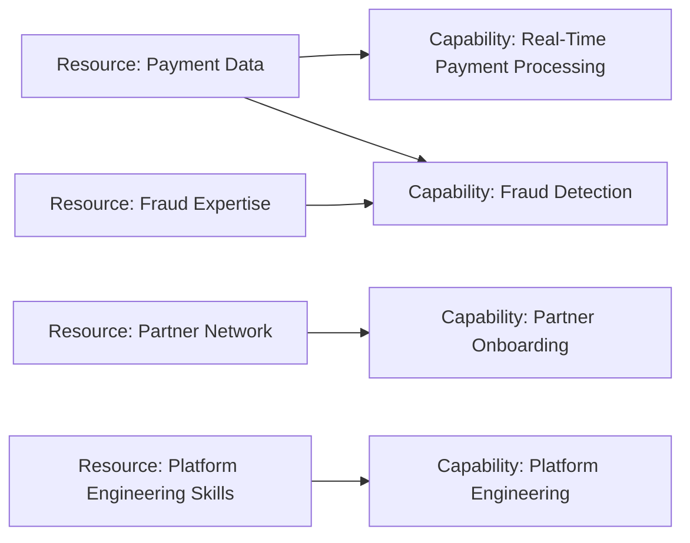

# Resource

Un **Resource** représente un actif possédé ou contrôlé par une personne ou une organisation.

Le concept est volontairement large : une ressource peut être tangible ou intangible, humaine, informationnelle, financière ou technologique, tant qu’elle constitue un actif mobilisable par l’entreprise.

---

## 1. Pourquoi modéliser une Resource ?

Une Capability n’existe pas dans le vide.

Pour savoir faire quelque chose, l’entreprise mobilise des ressources.

Exemple :

```text
Capability: Fraud Detection
Resources:
- Fraud Expertise
- Historical Fraud Data
- Risk Models
- Investigation Team
```

La Resource aide donc à répondre :

> De quels actifs dépend cette aptitude ?

---

## 2. Ressources tangibles et intangibles

### Tangibles

- infrastructure physique ;
- équipements ;
- locaux ;
- capital financier.

### Intangibles

- données ;
- expertise ;
- réputation ;
- contrats ;
- propriété intellectuelle ;
- réseau de partenaires.

Dans une architecture d’entreprise, les ressources intangibles sont souvent particulièrement importantes.

---

## 3. Resource vs Business Actor

Une équipe peut apparaître de deux façons selon l’intention du modèle.

### Comme Business Actor

On s’intéresse à son rôle dans l’exécution du métier.

```text
Business Actor: Fraud Operations Team
```

### Comme Resource

On s’intéresse à l’actif ou à la compétence mobilisable.

```text
Resource: Fraud Investigation Expertise
```

Il ne faut pas choisir mécaniquement le même concept pour toute vue.

---

## 4. Resource vs Data Object

```text
Resource: Customer Data Asset
Data Object: Customer Profile
```

Le premier représente l’actif stratégique.
Le second représente une donnée structurée utilisée par des applications.

Un même domaine réel peut être vu à différents niveaux d’abstraction.

---

## 5. Resource vs Technology Node

```text
Resource: Cloud Platform Capacity
Node: OpenShift Worker Cluster
```

La Resource peut représenter l’actif stratégique ou opérationnel disponible.
Le Node décrit un élément technologique concret de l’architecture.

---

## 6. MayaBank : Resource Map



---

## 7. Resource et stratégie d’investissement

Une organisation peut avoir une Capability faible parce qu’une Resource critique manque ou est insuffisante.

Exemple :

```text
Capability: Transaction Observability
Assessment: maturité 2/5
Cause possible:
Resource: Distributed Tracing Expertise insuffisante
```

Le plan d’amélioration peut alors viser la Resource, pas uniquement la technologie.

---

## 8. Use case : GenAI Platform

### Capability

`Enterprise GenAI Delivery`

### Resources possibles

- curated enterprise data ;
- GPU capacity ;
- AI engineering expertise ;
- model evaluation assets ;
- security policies ;
- reusable prompt / RAG components.

Le modèle montre que posséder une plateforme technique ne suffit pas : la capability dépend aussi de connaissances, données et gouvernance.

---

## 9. Use case : Disaster Recovery

### Capability

`Disaster Recovery`

### Resources

- secondary site ;
- backup data ;
- recovery procedures ;
- trained operations team ;
- network capacity ;
- DR testing environment.

Une Resource Map aide à identifier les points de dépendance de la capability.

---

## 10. Pièges

### Piège — Resource = serveur

Un serveur peut être modélisé plus précisément comme Device ou Node dans Technology.

Utiliser Resource si l’on veut représenter l’actif stratégique ou sa disponibilité à un niveau plus abstrait.

### Piège — Resource = n’importe quoi

Le concept est large, mais il doit toujours représenter un actif détenu ou contrôlé et pertinent pour la stratégie.

### Piège — Confondre capacité et ressource

```text
Resource: Fraud Expertise
Capability: Fraud Detection
```

L’expertise est un actif.
La détection est une aptitude.

---

## 11. Questions / réponses

### Q1
« Base historique de fraude utilisée pour entraîner les modèles. »

**Resource** est un bon choix dans une vue Strategy si l’on insiste sur sa valeur d’actif stratégique.

### Q2
« Savoir onboarder un partenaire en moins de 10 jours. »

**Capability**, pas Resource.

### Q3
« Payment Operations Team ». Resource ou Business Actor ?

Cela dépend de la question. Business Actor si l’on montre qui exécute un comportement ; Resource si l’on représente l’actif humain/organisationnel mobilisable à un niveau stratégique.

### Q4
Pourquoi modéliser les Resources avec les Capabilities ?

Pour identifier les actifs qui rendent l’aptitude possible et comprendre où investir ou réduire un risque de dépendance.

---

## À retenir

> **Resource = ce que l’entreprise possède ou contrôle et peut mobiliser.**

Une bonne architecture ne cartographie pas seulement les applications : elle montre aussi les actifs essentiels qui soutiennent les capabilities stratégiques.
