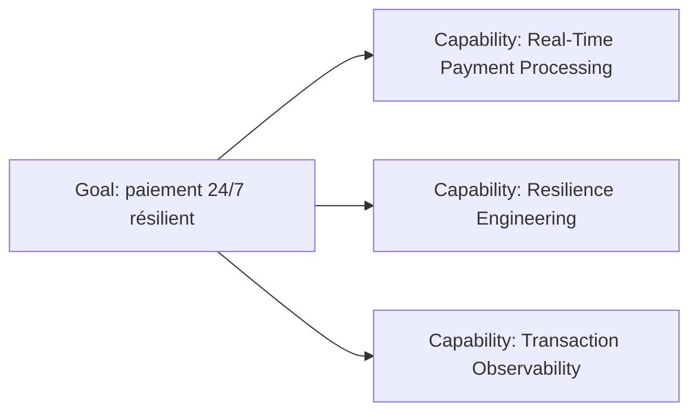
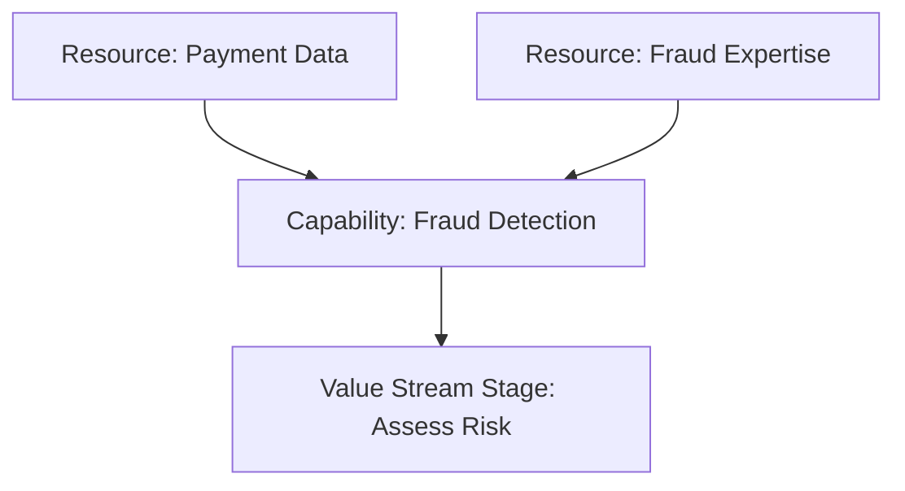

# Capability

Une **Capability** représente une aptitude qu’un élément de structure active, comme une organisation, une personne ou un système, possède.

Dans l’architecture d’entreprise, c’est l’un des concepts les plus importants pour relier stratégie, métier et investissement.

---

## 1. La question à poser

> **Qu’est-ce que l’entreprise doit être capable de faire ?**

Exemples MayaBank :

- Real-Time Payment Processing ;
- Fraud Detection ;
- Partner Onboarding ;
- Transaction Observability ;
- Disaster Recovery ;
- API Management ;
- Data Governance ;
- Cloud Platform Engineering.

---

## 2. Capability vs Application

C’est la confusion numéro 1.

```text
Capability: Real-Time Payment Processing
Application Component: Payment Orchestrator
```

La capability peut survivre à plusieurs générations d’applications.

Aujourd’hui :

```text
Legacy Payment Engine
```

Demain :

```text
Payment Orchestrator
```

La capability reste :

```text
Real-Time Payment Processing
```

---

## 3. Capability vs Business Process

```text
Capability: Customer Onboarding
Business Process: Open Customer Account
```

La capability décrit l’aptitude globale.
Le process décrit un comportement exécuté.

Une capability peut être réalisée par plusieurs processus.

---

## 4. Capability vs Business Function

Business Function et Capability sont souvent confondues car toutes deux peuvent sembler stables.

### Capability

Exprime **ce que l’organisation sait faire**.

### Business Function

Exprime **un regroupement de comportements métier selon certains critères**, souvent aligné à une organisation ou une compétence.

Exemple :

```text
Capability: Fraud Detection
Business Function: Fraud Operations
```

---

## 5. Capability vs Resource

```text
Capability: Fraud Detection
Resource: Fraud Expertise
```

La Resource contribue à rendre la Capability possible.

---

## 6. Capability Map

Une Capability Map organise les aptitudes de l’entreprise, généralement de manière hiérarchique.

Exemple MayaBank :

```text
Payments
├── Payment Initiation
├── Payment Validation
├── Real-Time Payment Processing
├── Fraud Detection
├── Clearing Integration
├── Settlement Reconciliation
├── Exception Management
└── Payment Tracking
```

La hiérarchie peut être représentée avec des relations structurelles adaptées.

---

## 7. Capability heatmap

Une Capability Map devient un outil de décision lorsqu’on ajoute des propriétés d’analyse.

| Capability | Importance | Maturité actuelle | Cible | Priorité |
|---|---:|---:|---:|---:|
| Real-Time Payment Processing | Critique | 2 | 5 | Très haute |
| Fraud Detection | Critique | 3 | 5 | Haute |
| Payment Tracking | Haute | 2 | 4 | Haute |
| Settlement Reconciliation | Haute | 4 | 4 | Faible |

ArchiMate donne le langage pour les capabilities et relations ; la heatmap est une technique d’analyse complémentaire.

---

## 8. Capability et Goal



La question devient : quelles aptitudes doivent être créées ou renforcées pour atteindre le Goal ?

---

## 9. Capability et Value Stream

Un stage de Value Stream peut être rendu possible par une ou plusieurs capabilities.

Exemple :

```text
Value Stream Stage: Assess Risk
Capabilities:
- Fraud Detection
- Customer Risk Assessment
- Transaction Scoring
```

C’est une utilisation extrêmement forte d’ArchiMate : relier la création de valeur aux capacités nécessaires.

---

## 10. Capability et ressources



---

## 11. Use case : OpenShift

Ne pas créer :

```text
Capability: OpenShift
```

OpenShift est une technologie / plateforme.

Des capabilities plus correctes :

- Container Platform Operations ;
- Cloud-Native Application Delivery ;
- Automated Deployment ;
- Platform Observability ;
- Application Resilience Engineering.

OpenShift pourra ensuite réaliser ou supporter ces capabilities via les couches Application/Technology selon le niveau choisi.

---

## 12. Use case : Kafka

Éviter :

```text
Capability: Kafka
```

Préférer :

- Event Streaming ;
- Asynchronous Integration ;
- Event Distribution ;
- Event-Driven Integration.

Kafka est un choix de réalisation.

---

## 13. Use case : GenAI

Capabilities possibles :

- Enterprise Knowledge Retrieval ;
- Model Evaluation ;
- Prompt & RAG Engineering ;
- AI Governance ;
- Responsible AI Control ;
- GPU Workload Management.

Applications et plateformes viennent ensuite.

---

## 14. Capability stable, réalisation variable

C’est un principe de conception important.

```text
2024
Capability: Payment Tracking
→ Legacy Tracking Application

2027
Capability: Payment Tracking
→ Event-Driven Tracking Platform
```

La capability permet de comparer les architectures sans être prisonnier des produits.

---

## 15. Capability gaps

On peut identifier plusieurs types de gap :

- capability inexistante ;
- capability sous-mature ;
- capability redondante ;
- capability trop coûteuse ;
- capability non alignée au target operating model.

Exemple :

```text
Baseline maturity: Transaction Observability = 1/5
Target maturity: 4/5
Gap: tracing, correlation, ownership, operational practices
```

---

## 16. Anti-patterns

### Application Map déguisée

```text
Capabilities:
- Salesforce
- Kafka
- OpenShift
- Oracle
```

Faux : ce sont des technologies/produits, pas des aptitudes.

### Verbes trop fins

Une capability ne doit pas devenir chaque étape d’un processus.

### Capabilities trop abstraites

```text
Capability: Excellence
```

Trop vague pour aider à l’architecture.

### Mélange de niveaux

```text
Payments
- Fraud Detection
- Kafka
- Customer Service Team
```

On mélange capability, technologie et organisation.

---

## 17. Questions / réponses

### Q1
« Détecter une fraude avant autorisation. »

**Capability : Real-Time Fraud Detection.**

### Q2
« Payment Orchestrator ». Capability ?

**Non.** C’est typiquement un Application Component.

### Q3
« Execute Payment ». Capability ou Business Process ?

Si l’on décrit l’aptitude : `Payment Execution` peut être Capability. Si l’on décrit le comportement ordonné : `Execute Payment` est plutôt Business Process. Le contexte et la formulation comptent.

### Q4
Pourquoi une Capability Map est-elle utile avant de choisir les solutions ?

Parce qu’elle identifie les aptitudes stratégiques nécessaires indépendamment des produits et applications existants.

### Q5
Quelle différence essentielle entre Capability et Resource ?

Capability = aptitude ; Resource = actif mobilisable qui contribue à cette aptitude.

---

## À retenir

> **Capability = ce que l’entreprise est capable de faire, indépendamment de l’application ou de la technologie qui le réalise aujourd’hui.**

C’est l’un des meilleurs concepts ArchiMate pour passer d’une architecture centrée sur les systèmes à une architecture centrée sur les capacités métier et stratégiques.
