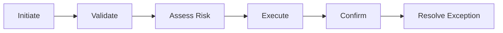

# Value Stream

Un **Value Stream** représente une séquence d’activités ou d’étapes qui crée un résultat global pour un client, un stakeholder ou un utilisateur final.

Il est orienté **valeur de bout en bout**, pas organisation interne ni détail procédural.

---

## 1. La question à poser

> **Comment la valeur est-elle créée de bout en bout pour le bénéficiaire ?**

Exemple MayaBank :

```text
Initiate Payment
→ Validate Payment
→ Assess Risk
→ Execute Payment
→ Confirm Outcome
→ Resolve Exception
```

Chaque étape peut être appelée **Value Stream Stage** dans un modèle détaillé de flux de valeur.

---

## 2. Value Stream vs Business Process

C’est une confusion fréquente.

### Value Stream

- vue orientée valeur ;
- de bout en bout ;
- indépendante de l’organisation détaillée ;
- plus stable que les processus d’implémentation.

### Business Process

- comportement métier structuré ;
- séquence d’activités métier ;
- peut être exécuté par des rôles/acteurs ;
- réalise une partie du fonctionnement opérationnel.

Exemple :

```text
Value Stream Stage: Validate Payment
Business Processes:
- Validate Message Format
- Check Customer Eligibility
- Check Payment Limits
```

---

## 3. Value Stream vs Customer Journey

Ils peuvent se recouper mais ne sont pas identiques.

Un Customer Journey met fortement l’accent sur l’expérience et les interactions vécues par le client.

Un Value Stream représente la création de valeur de bout en bout, y compris des étapes internes invisibles au client.

---

## 4. Value Stream vs Capability

```text
Value Stream Stage: Assess Risk
Capabilities:
- Fraud Detection
- Transaction Scoring
- Customer Risk Assessment
```

Le Value Stream montre **où la valeur est créée**.
La Capability montre **ce qu’il faut savoir faire** pour réaliser cette étape.

---

## 5. MayaBank — Instant Payment Value Stream



### Capabilities associées

| Value Stream Stage | Capabilities principales |
|---|---|
| Initiate | Payment Initiation, Channel Integration |
| Validate | Payment Validation, Customer Eligibility |
| Assess Risk | Fraud Detection, Transaction Scoring |
| Execute | Real-Time Payment Processing, Clearing Integration |
| Confirm | Payment Tracking, Customer Notification |
| Resolve Exception | Exception Management, Reconciliation |

Cette matrice est très utile pour identifier où renforcer les capabilities.

---

## 6. Value Stream et heatmap

On peut analyser chaque stage selon :

- valeur client ;
- durée ;
- coût ;
- automatisation ;
- risque ;
- maturité des capabilities ;
- nombre d’applications impliquées.

Exemple :

| Stage | Délai | Automatisation | Risque | Commentaire |
|---|---:|---:|---:|---|
| Initiate | faible | élevée | faible | stable |
| Validate | moyen | moyenne | moyen | règles dispersées |
| Assess Risk | élevé | moyenne | élevé | scoring tardif |
| Execute | variable | élevée | critique | dépendance legacy |
| Confirm | élevé | faible | moyen | statuts fragmentés |

Ces propriétés d’analyse ne sont pas des éléments ArchiMate supplémentaires ; elles enrichissent le modèle.

---

## 7. Use case : onboarding partenaire

```text
Discover Partner
→ Qualify
→ Contract
→ Integrate
→ Certify
→ Activate
```

Capabilities :

- Partner Management ;
- Contract Management ;
- API Management ;
- Partner Testing ;
- Security Assessment.

Le modèle peut révéler que `Integrate` et `Certify` concentrent les délais, ce qui justifie des investissements ciblés.

---

## 8. Use case : incident critique

Value Stream possible :

```text
Detect
→ Diagnose
→ Contain
→ Recover
→ Verify
→ Learn
```

Capabilities :

- Monitoring ;
- Incident Diagnosis ;
- Automated Recovery ;
- Disaster Recovery ;
- Problem Management.

Une architecture d’observabilité peut alors être reliée directement à la création de valeur opérationnelle : réduction du temps de restauration du service.

---

## 9. Use case : GenAI

Value Stream :

```text
Identify Use Case
→ Prepare Knowledge
→ Build / Configure
→ Evaluate
→ Govern
→ Deploy
→ Monitor
```

Capabilities :

- Knowledge Curation ;
- Prompt/RAG Engineering ;
- Model Evaluation ;
- AI Governance ;
- AI Platform Operations.

---

## 10. Value Stream et architecture applicative

On peut passer progressivement :

```text
Value Stream Stage: Execute Payment
↓
Capability: Real-Time Payment Processing
↓
Business Process: Execute Instant Payment
↓
Application Service: Payment Orchestration
↓
Application Component: Payment Orchestrator
```

Cette chaîne relie valeur, aptitude, métier et système.

---

## 11. Anti-patterns

### Value Stream = organigramme

```text
Sales → IT → Security → Operations
```

Ce n’est pas un flux de valeur ; c’est une succession d’équipes.

### Value Stream trop détaillé

Si le modèle contient toutes les tâches et décisions d’un workflow, BPMN ou Business Process ArchiMate est probablement plus adapté.

### Value Stream purement technique

```text
API Gateway → Kafka → Database → OpenShift
```

Ce n’est pas un Value Stream : c’est un flux de composants techniques.

### Stage sans valeur identifiable

Chaque stage doit contribuer au résultat global du Value Stream.

---

## 12. Questions / réponses

### Q1
« Initiate → Validate → Execute → Confirm » représente quoi si l’on montre le parcours de création de valeur du paiement ?

**Value Stream.**

### Q2
« Validate Message Format → Check Limit → Persist Result » ?

Cela ressemble davantage à un **Business Process** ou à un comportement applicatif selon le niveau.

### Q3
Pourquoi associer Capabilities et Value Stream Stages ?

Pour comprendre quelles aptitudes permettent de créer la valeur à chaque étape et où se trouvent les gaps.

### Q4
Un Value Stream doit-il montrer l’application qui réalise chaque étape ?

Pas nécessairement. Une vue Strategy peut rester indépendante des solutions. Une vue cross-layer peut ensuite ajouter les applications si cela répond au concern.

---

## À retenir

> **Value Stream = comment la valeur est créée de bout en bout.**

Il ne faut pas le confondre avec le détail d’un processus, l’organigramme ou le flux technique. Sa force est de relier valeur et capabilities avant de descendre vers les réalisations métier et technologiques.
