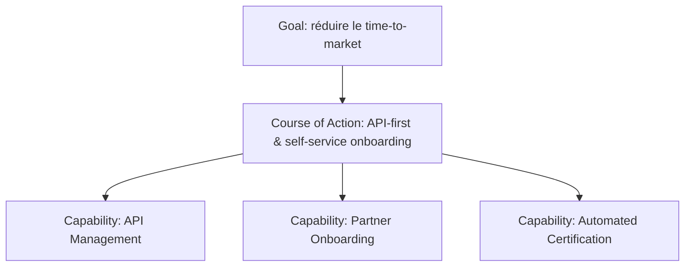

# Course of Action

Un **Course of Action** représente une approche ou direction choisie pour configurer des capabilities et des resources afin d’atteindre un Goal.

Il répond à la question :

> **Quelle stratégie ou approche allons-nous suivre ?**

---

## 1. Exemples

MayaBank peut choisir plusieurs Courses of Action :

- moderniser progressivement la plateforme de paiement ;
- privilégier les API pour les interactions synchrones ;
- utiliser des événements pour les traitements asynchrones et découplés ;
- automatiser les contrôles d’exploitation ;
- consolider les fonctions dupliquées ;
- migrer par vagues pour réduire le risque ;
- développer d’abord les capabilities critiques.

---

## 2. Course of Action vs Goal

```text
Goal: réduire le risque de migration
Course of Action: migration progressive par vagues avec coexistence temporaire
```

Le Goal décrit ce que l’on cherche.
Le Course of Action décrit l’approche choisie.

---

## 3. Course of Action vs Principle

Ils peuvent sembler proches.

### Principle

Règle générale durable qui guide les décisions.

```text
Principle: Automation First
```

### Course of Action

Approche choisie pour atteindre un objectif dans un contexte donné.

```text
Course of Action: automatiser en priorité les contrôles de déploiement et de rollback de la migration
```

---

## 4. Course of Action vs Requirement

```text
Course of Action: migrer progressivement
Requirement: chaque vague doit permettre un rollback contrôlé
```

Le Course of Action définit la direction.
Le Requirement impose une propriété précise de l’exécution.

---

## 5. Course of Action vs Work Package

C’est une confusion classique entre Strategy et Implementation & Migration.

```text
Course of Action: moderniser progressivement la plateforme
Work Package: construire la plateforme cible
Work Package: migrer le pilote instant payment
Work Package: migrer les exceptions
Work Package: retirer le legacy
```

Le Course of Action reste stratégique.
Les Work Packages sont des ensembles de travaux concrets.

---

## 6. Course of Action et Capability

Une approche stratégique peut déterminer quelles capabilities doivent être développées.



---

## 7. Use case : OpenShift

### Goal

Améliorer la vitesse et la fiabilité des déploiements.

### Course of Action

Adopter un modèle platform engineering avec déploiement déclaratif et self-service contrôlé.

### Capabilities

- Cloud-Native Application Delivery ;
- GitOps Delivery ;
- Platform Observability ;
- Automated Policy Enforcement.

### Réalisation possible

OpenShift + GitOps + politiques + observabilité.

Le produit apparaît seulement après le raisonnement stratégique.

---

## 8. Use case : Event-Driven Architecture

### Driver

Croissance des volumes et besoin de découplage.

### Goal

Réduire les dépendances synchrones et améliorer la résilience.

### Course of Action

Adopter des interactions event-driven lorsque le contexte permet un traitement asynchrone.

### Capabilities

- Event Streaming ;
- Event Governance ;
- Schema Management ;
- Event Observability.

### Réalisation possible

Kafka ou autre plateforme compatible.

---

## 9. Use case : Green IT

### Goal

Réduire l’empreinte numérique à valeur métier équivalente.

### Course of Action

- supprimer les ressources inutilisées ;
- privilégier l’élasticité ;
- mesurer avant optimisation ;
- réduire la rétention sans valeur ;
- rationaliser les composants redondants.

Des capabilities comme `GreenOps Measurement` ou `Capacity Optimization` peuvent être développées.

---

## 10. Plusieurs Courses of Action

Un Goal peut être atteint par plusieurs stratégies possibles.

Exemple : réduire le time-to-market.

### Option A

`Course of Action: standardiser les plateformes`

### Option B

`Course of Action: créer des produits self-service`

### Option C

`Course of Action: réduire le nombre d’approbations manuelles`

L’architecture peut comparer les impacts sur les capabilities, resources et risques avant de décider.

---

## 11. Anti-patterns

### Produit présenté comme stratégie

```text
Course of Action: acheter Kafka
```

Trop orienté produit.

Meilleur :

```text
Course of Action: adopter une architecture event-driven pour les flux asynchrones éligibles
```

### Course of Action trop vague

```text
Course of Action: devenir meilleur
```

N’aide pas à prendre des décisions.

### Course of Action trop détaillé

```text
Course of Action: changer le timeout du service X à 2500 ms
```

C’est une décision technique fine, pas une direction stratégique.

---

## 12. Questions / réponses

### Q1
« Migrer par vagues pour limiter le risque. »

**Course of Action.**

### Q2
« Chaque vague doit supporter un rollback automatisé. »

**Requirement.**

### Q3
« Construire le cluster de production. »

**Work Package** ou activité de projet selon le niveau, pas Course of Action.

### Q4
« Automation First ». Principle ou Course of Action ?

Le plus souvent **Principle** si c’est une règle générale. Une déclinaison contextuelle comme « automatiser en priorité les contrôles de migration » peut devenir Course of Action.

### Q5
Pourquoi un Course of Action est-il utile avant les Work Packages ?

Parce qu’il explicite la direction stratégique qui doit guider la transformation avant de la découper en travaux concrets.

---

## À retenir

> **Course of Action = l’approche choisie pour transformer les intentions stratégiques en évolution des capabilities et resources.**

Il se situe entre le Goal et les décisions concrètes de transformation.
