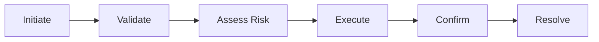
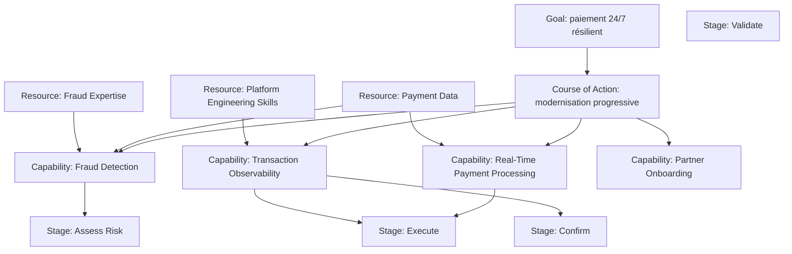

# Strategy — modèle complet MayaBank

Ce chapitre assemble `Resource`, `Capability`, `Value Stream` et `Course of Action` dans un même raisonnement d’entreprise.

---

## 1. Contexte stratégique

MayaBank a défini plusieurs objectifs :

- paiement instantané résilient 24/7 ;
- réduction du risque opérationnel ;
- onboarding partenaire plus rapide ;
- meilleure observabilité ;
- réduction de la dépendance legacy.

La question Strategy devient :

> **Quelles aptitudes, ressources, flux de valeur et directions d’action permettent d’atteindre ces objectifs ?**

---

## 2. Capability Map cible

```text
Payments
├── Payment Initiation
├── Payment Validation
├── Real-Time Payment Processing
├── Fraud Detection
├── Clearing Integration
├── Settlement Reconciliation
├── Exception Management
├── Payment Tracking
├── Partner Onboarding
└── Transaction Observability
```

### Platform & Operations

```text
Platform Engineering
├── Cloud-Native Application Delivery
├── GitOps Delivery
├── Resilience Engineering
├── Observability Engineering
└── Disaster Recovery
```

---

## 3. Resources clés

```text
Payment Data
Fraud Expertise
Partner Network
Platform Engineering Skills
Operational Knowledge
Customer Relationship Data
Cloud Capacity
```

Les Resources soutiennent les Capabilities mais ne doivent pas être confondues avec elles.

---

## 4. Value Stream principal



### Capability mapping

| Stage | Capabilities |
|---|---|
| Initiate | Payment Initiation, Channel Integration |
| Validate | Payment Validation, Eligibility |
| Assess Risk | Fraud Detection, Transaction Scoring |
| Execute | Real-Time Payment Processing, Clearing Integration |
| Confirm | Payment Tracking, Customer Notification |
| Resolve | Exception Management, Reconciliation |

---

## 5. Courses of Action

MayaBank choisit plusieurs directions :

### COA-01 — Migration progressive

Moderniser par vagues avec coexistence contrôlée.

### COA-02 — API-first

Standardiser l’exposition synchrone via contrats d’API gouvernés.

### COA-03 — Event-driven when appropriate

Découpler les traitements asynchrones éligibles via événements gouvernés.

### COA-04 — Platform engineering

Fournir des services de plateforme automatisés et réutilisables.

### COA-05 — Observability by default

Intégrer la télémétrie comme capacité de base, pas comme ajout tardif.

---

## 6. Vue Strategy intégrée



---

## 7. Passer de Strategy à Business

Prenons :

```text
Capability: Real-Time Payment Processing
```

Cette capability peut être mise en œuvre par :

```text
Business Process: Execute Instant Payment
Business Service: Instant Payment Service
Business Roles: Payment Operations, Payment Product
```

La Capability ne disparaît pas. Elle reste le niveau stratégique au-dessus du modèle opérationnel.

---

## 8. Passer de Strategy à Application

```text
Capability: Transaction Observability
↓
Business/Operational behavior: Monitor Payment Transaction
↓
Application Service: Transaction Observability Service
↓
Application Component: Observability Portal / Correlation Service
```

---

## 9. Passer de Strategy à Technology

```text
Capability: Cloud-Native Application Delivery
↓
Application/Platform Service
↓
Technology Service: Container Execution
↓
Node / System Software: OpenShift Platform
```

Le modèle garde ainsi la chaîne de traçabilité depuis l’intention jusqu’à la réalisation.

---

## 10. Capability gap analysis

### Baseline

| Capability | Maturité |
|---|---:|
| Real-Time Payment Processing | 2/5 |
| Fraud Detection | 3/5 |
| Transaction Observability | 1/5 |
| Partner Onboarding | 2/5 |
| Resilience Engineering | 2/5 |

### Target

| Capability | Maturité cible |
|---|---:|
| Real-Time Payment Processing | 5/5 |
| Fraud Detection | 5/5 |
| Transaction Observability | 4/5 |
| Partner Onboarding | 4/5 |
| Resilience Engineering | 5/5 |

### Gaps

Les gaps ne se résument pas à acheter de la technologie. Ils peuvent concerner :

- compétences ;
- operating model ;
- processus ;
- données ;
- architecture applicative ;
- technologie ;
- gouvernance.

---

## 11. Investment view

Une Capability Map peut guider l’investissement :

```text
High importance + low maturity = priorité forte
High importance + high maturity = protéger / optimiser
Low importance + high cost = rationaliser
Duplicated capability realization = simplifier
```

Exemple : `Transaction Observability` est critique mais immature : investissement prioritaire.

---

## 12. Anti-pattern : stratégie = catalogue technologique

Mauvais :

```text
Strategic Capabilities
- Kafka
- OpenShift
- Oracle
- API Gateway
```

Correct :

```text
Strategic Capabilities
- Event Streaming
- Cloud-Native Application Delivery
- Data Management
- API Management
```

Puis les produits peuvent apparaître comme réalisations plus bas dans le modèle.

---

## 13. Exercice : modernisation fraude

### Contexte

Le scoring fraude est lent, fragmenté et produit trop de faux positifs.

### Travail

Définissez :

- 3 Capabilities ;
- 3 Resources ;
- un Value Stream en 5 stages ;
- 2 Courses of Action.

### Correction possible

**Capabilities**
- Real-Time Fraud Detection
- Transaction Scoring
- Fraud Investigation

**Resources**
- Historical Fraud Data
- Fraud Expertise
- Risk Models

**Value Stream**

```text
Collect Context
→ Score Transaction
→ Decide
→ Investigate Exception
→ Learn / Improve
```

**Courses of Action**
- déplacer le scoring plus tôt dans le cycle de paiement ;
- unifier la gouvernance des règles et modèles fraude.

---

## 14. Questions de synthèse

### Q1
Quelle différence fondamentale entre Capability et Application ?

**Capability = aptitude ; Application = moyen logiciel de réalisation.**

### Q2
Quel concept représente un actif stratégique ?

**Resource.**

### Q3
Quel concept représente le chemin de création de valeur ?

**Value Stream.**

### Q4
Quel concept représente une direction ou approche choisie ?

**Course of Action.**

### Q5
Pourquoi relier Value Stream et Capability ?

Pour identifier quelles aptitudes permettent la création de valeur à chaque étape et où concentrer les transformations.

### Q6
Pourquoi la Strategy Layer est-elle utile entre Motivation et Business ?

Parce qu’elle transforme les objectifs en aptitudes et directions stratégiques avant de détailler les processus, rôles et services métier.

---

## À retenir

```text
Motivation = pourquoi changer
Strategy = ce qu'il faut savoir faire et quelle direction prendre
Business = comment le métier fonctionne
Application = comment les systèmes le supportent
Technology = comment les systèmes sont exécutés
```

> **Une bonne Strategy Architecture reste compréhensible même si les produits technologiques changent.**
