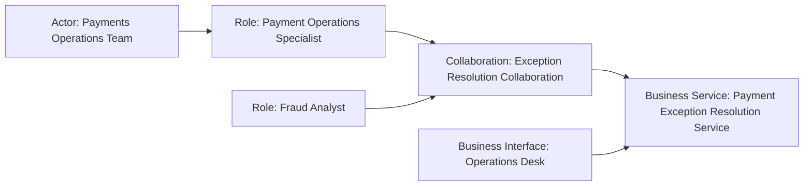

# Business Active Structure — Actor, Role, Collaboration et Interface

La **structure active** répond à une question simple :

> **Qui est capable d’exécuter un comportement métier, seul ou collectivement, et par quel point d’accès un service est-il exposé ?**

Les quatre concepts principaux étudiés ici sont :

- `Business Actor`
- `Business Role`
- `Business Collaboration`
- `Business Interface`

---

## 1. Business Actor

Un **Business Actor** représente une entité métier capable d’exécuter un comportement.

Il peut s’agir par exemple :

- d’une organisation ;
- d’une unité organisationnelle ;
- d’une personne ;
- d’un partenaire ;
- d’une entité externe.

### Exemples MayaBank

- MayaBank
- Payments Operations Department
- Fraud Operations Team
- Corporate Customer
- Clearing Partner

### Ce qu’un Actor n’est pas

Un Actor n’est pas :

- une responsabilité abstraite ;
- un processus ;
- une application ;
- une capability.

### Actor vs Stakeholder

Un `Stakeholder` est défini par son **intérêt dans les effets de l’architecture**.

Un `Business Actor` est défini par sa **capacité à exécuter un comportement métier**.

La même entité réelle peut apparaître dans les deux rôles conceptuels selon la vue.

Exemple :

```text
Stakeholder: Head of Payments
Business Actor: Payments Department
```

---

## 2. Business Role

Un **Business Role** représente une responsabilité pour l’exécution d’un comportement métier, ou le rôle qu’un acteur joue dans une situation.

### Exemples

- Payment Initiator
- Payment Approver
- Fraud Analyst
- Payment Operations Specialist
- Customer
- Service Provider

### Pourquoi séparer Actor et Role ?

Parce que l’organisation réelle et la responsabilité ne sont pas la même chose.

```text
Actor: Fraud Operations Team
Role : Fraud Analyst
```

Un acteur peut être affecté à plusieurs rôles.

```text
Payments Operations Team
 ├─ Payment Operations Specialist
 └─ Exception Manager
```

Et plusieurs acteurs peuvent tenir le même rôle.

```text
Paris Operations Team ─┐
                       ├─ Payment Operations Specialist
Lyon Operations Team  ─┘
```

Cette distinction permet de raisonner sur une réorganisation sans mélanger structure organisationnelle et responsabilités.

---

## 3. Actor vs Role : méthode de décision

Pose deux questions.

### Question A

> Est-ce que je parle de **l’entité réelle** qui agit ?

→ `Business Actor`

### Question B

> Est-ce que je parle de **la responsabilité** ou du rôle joué ?

→ `Business Role`

### Exemple bancaire

`Customer` peut être un Role lorsqu’on veut exprimer le rôle qu’une personne ou une organisation joue vis-à-vis d’un service.

`ACME Corporation` peut être un Actor spécifique si le modèle veut représenter cette organisation réelle.

---

## 4. Relation Actor → Role

Un pattern courant est l’**Assignment** :

```text
Business Actor
   ── assigned to ──>
Business Role
```

Exemple :

```text
Payments Operations Team
   → Payment Operations Specialist
```

L’idée est : l’acteur remplit cette responsabilité.

La relation `Assignment` sera étudiée en détail dans la partie Relations.

---

## 5. Business Collaboration

Une **Business Collaboration** représente un agrégat de plusieurs éléments de structure active métier qui travaillent ensemble pour réaliser un comportement collectif.

Elle devient utile lorsque l’on veut représenter **l’unité de coopération elle-même**, pas simplement deux acteurs côte à côte.

### Exemple MayaBank

Pour résoudre une fraude complexe :

- Fraud Analyst
- Payment Operations Specialist
- Compliance Officer

peuvent participer à :

`Payment Fraud Resolution Collaboration`

La collaboration peut exécuter un `Business Interaction` collectif.

---

## 6. Collaboration vs Actor

### Actor

Entité capable d’agir.

### Collaboration

Regroupement de plusieurs participants travaillant ensemble pour un comportement collectif.

Exemple :

```text
Actors/Roles:
- Payment Operations Specialist
- Fraud Analyst

Collaboration:
- Payment Exception Resolution Collaboration
```

Ne crée pas une Collaboration simplement pour dessiner un rectangle autour de plusieurs acteurs.

Elle doit avoir une signification métier : **une coopération structurée**.

---

## 7. Collaboration vs Grouping

`Grouping` est un mécanisme générique d’organisation du modèle.

`Business Collaboration` possède une sémantique métier forte : plusieurs éléments actifs coopèrent pour un comportement collectif.

Donc :

```text
"je veux juste ranger visuellement 4 éléments"
→ Grouping

"ces rôles coopèrent réellement comme unité métier"
→ Business Collaboration
```

---

## 8. Business Interface

Une **Business Interface** représente un point d’accès où un Business Service est rendu disponible à l’environnement.

Le mot clé est : **point d’accès**.

### Exemples

- Branch Counter
- Customer Service Desk
- Corporate Banking Portal comme point métier de contact, selon le niveau de modélisation
- Relationship Manager Channel
- Partner Access Point

### Interface vs Service

L’interface est le **où/par quoi on accède**.

Le service est le **comportement exposé**.

```text
Business Interface: Corporate Banking Portal
Business Service  : Instant Payment Service
```

---

## 9. Business Interface vs Application Interface

C’est un piège classique.

### Business Interface

Point d’accès métier à un service métier.

### Application Interface

Point d’accès par lequel un Application Service est disponible.

Exemple :

```text
Business Interface: Corporate Banking Portal
Business Service: Instant Payment Service

Application Interface: Payments REST API
Application Service: Payment Initiation API Service
```

Le portail vu comme canal métier n’est pas nécessairement la même chose que son API technique.

---

## 10. Exemple complet MayaBank



Ce Mermaid est pédagogique ; la notation ArchiMate réelle sera construite dans les modèles dédiés.

---

## 11. Use case : externalisation d’une activité

MayaBank externalise une partie des opérations de contrôle.

### Baseline

```text
Actor: MayaBank Operations Team
Role : Manual Control Operator
```

### Target

```text
Actor: External Operations Provider
Role : Manual Control Operator
```

Le rôle peut rester identique alors que l’acteur change.

C’est exactement pourquoi la séparation Actor/Role est puissante.

---

## 12. Use case : automatisation

Supposons qu’un contrôle manuel soit automatisé.

Le rôle métier peut diminuer ou changer, mais on ne remplace pas simplement :

```text
Business Role → Application Component
```

Il faut analyser :

- quel comportement métier était exécuté ;
- quel Business Service doit rester disponible ;
- quelle Application Function automatise une partie du comportement ;
- quels rôles humains restent responsables.

ArchiMate aide à éviter la confusion entre responsabilité métier et réalisation technique.

---

## 13. Anti-patterns

### Anti-pattern 1 — Un Actor par nom de poste

`Payment Analyst` est souvent plutôt un Role qu’un Actor.

### Anti-pattern 2 — Une Collaboration comme simple conteneur graphique

Une vraie Collaboration doit exprimer une coopération métier.

### Anti-pattern 3 — Interface = écran

Une Business Interface n’est pas forcément un écran UI. C’est un point d’accès métier.

### Anti-pattern 4 — Customer toujours Actor

Le choix dépend du sens du modèle. `Customer` peut être un Role générique.

---

## 14. Questions de contrôle

### Q1
`MayaBank Payments Operations Department` ?

**Actor.**

### Q2
`Fraud Analyst` ?

**Role**, si l’on décrit la responsabilité.

### Q3
Deux rôles coopèrent pour traiter une exception. Quel élément peut représenter leur unité de coopération ?

**Business Collaboration.**

### Q4
Quel élément représente le point où un Business Service est accessible ?

**Business Interface.**

### Q5
Pourquoi ne faut-il pas fusionner Actor et Role ?

**Parce que l’entité organisationnelle et la responsabilité sont indépendantes : un acteur peut changer sans que le rôle change.**

---

## À retenir

> **Actor = qui existe ; Role = quelle responsabilité ; Collaboration = qui coopère ; Interface = où le service est accessible.**
