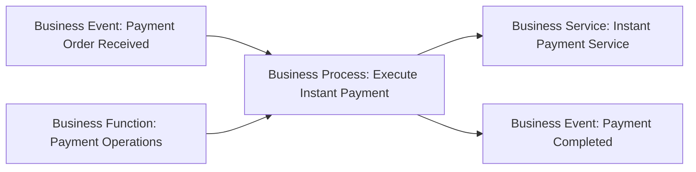

# Business Behavior — Process, Function, Interaction, Event et Service

La famille **Behavior** répond à la question :

> **Que fait le métier ?**

ArchiMate distingue plusieurs formes de comportement métier parce qu’un flux, une responsabilité stable, une coopération collective, un événement et un service exposé ne décrivent pas la même chose.

Les concepts étudiés ici sont :

- `Business Process`
- `Business Function`
- `Business Interaction`
- `Business Event`
- `Business Service`

---

## 1. Business Process

Un **Business Process** représente une séquence de comportements métier qui produit un résultat défini.

Le mot important est **séquence orientée résultat**.

### Exemples MayaBank

- Initiate Instant Payment
- Execute Instant Payment
- Resolve Payment Exception
- Onboard Corporate Customer
- Handle Chargeback

### Quand utiliser Process ?

Quand on veut montrer :

- un enchaînement ;
- un début et une fin conceptuels ;
- un résultat produit ;
- une traversée de plusieurs responsabilités.

### Process vs BPMN

ArchiMate décrit le processus à un niveau architectural.

BPMN peut détailler ensuite :

```text
Receive Order
→ Validate
→ Fraud Check
→ Authorize
→ Clear
→ Notify
```

Le Business Process ArchiMate reste utile pour relier ce comportement aux rôles, services, applications et données.

---

## 2. Business Function

Une **Business Function** regroupe des comportements métier selon un critère choisi, souvent une compétence, une ressource ou une responsabilité stable.

Elle répond plutôt à :

> **Quel type d’activité ou de responsabilité durable cette partie de l’organisation porte-t-elle ?**

### Exemples MayaBank

- Fraud Management
- Payment Operations
- Customer Relationship Management
- Treasury Management
- Compliance Management

### Function vs Process

```text
Function: Fraud Management
Process : Handle Suspicious Payment
```

La Function est relativement stable.
Le Process décrit un déroulement orienté vers un résultat.

---

## 3. Méthode Process vs Function

Pose deux questions.

### Question 1

> Est-ce que je veux montrer **comment un résultat est produit dans le temps ou dans une séquence** ?

→ Business Process

### Question 2

> Est-ce que je veux montrer **un regroupement stable de responsabilités/comportements** ?

→ Business Function

### Exemple

`Payment Operations` = Function.

`Resolve Failed Payment` = Process.

---

## 4. Business Interaction

Une **Business Interaction** représente une unité de comportement métier collectif exécutée par une collaboration de plusieurs participants.

Elle devient utile lorsqu’on veut représenter un comportement qui n’appartient pas naturellement à un seul rôle.

### Exemple MayaBank

`Investigate Complex Fraud Case`

peut être une Business Interaction exécutée collectivement par :

- Fraud Analyst ;
- Payment Operations Specialist ;
- Compliance Officer.

La collaboration associée pourrait être :

`Fraud Investigation Collaboration`.

---

## 5. Interaction vs Process

Un Process peut impliquer plusieurs participants, mais il reste avant tout décrit comme un **enchaînement de comportements**.

Une Interaction met explicitement l’accent sur le **comportement collectif**.

### Réflexe

```text
"plusieurs rôles coopèrent comme une unité"
→ Interaction

"un flux métier mène à un résultat"
→ Process
```

---

## 6. Business Event

Un **Business Event** représente un changement d’état organisationnel.

Il peut :

- déclencher un comportement ;
- résulter d’un comportement ;
- signaler qu’une situation métier est survenue.

### Exemples

- Payment Order Received
- Payment Rejected
- Fraud Alert Raised
- Customer Account Closed
- Settlement Completed

### Event vs Process

`Payment Rejected` n’est pas un Process.

Il représente le fait qu’un état métier a changé ou qu’une situation est survenue.

### Event vs Message

Un Event n’est pas automatiquement un message technique Kafka.

Un message peut réaliser ou transporter une information associée à un événement, mais le Business Event décrit le fait métier.

Exemple :

```text
Business Event: Payment Rejected
Application Event: PaymentRejected event emitted
Technology Artifact/Event payload: JSON message
```

Le niveau dépend du modèle.

---

## 7. Business Service

Un **Business Service** représente un comportement métier explicitement exposé à l’environnement.

Le mot important est **exposé**.

### Exemples MayaBank

- Instant Payment Service
- Account Opening Service
- Payment Status Service
- Fraud Investigation Service
- Corporate Cash Management Service

### Service vs Process

```text
Process : Execute Instant Payment
Service : Instant Payment Service
```

Le Process est interne.
Le Service est ce qui est rendu disponible à un consommateur.

---

## 8. Service vs Function

Une Function est un regroupement interne de comportement.

Un Service est une capacité comportementale exposée.

```text
Function: Payment Operations
Service : Payment Exception Resolution Service
```

La Function peut réaliser ou contribuer à réaliser le Service.

---

## 9. Service vs Capability

### Capability

Aptitude que l’entreprise possède ou doit posséder.

### Business Service

Comportement que l’entreprise expose à un consommateur.

Exemple :

```text
Capability: Real-Time Payment Processing
Business Service: Instant Payment Service
```

La capability décrit une aptitude globale.
Le service décrit ce que le consommateur peut obtenir.

---

## 10. Service vs Product

Un Product peut regrouper plusieurs Business Services.

Exemple :

```text
Product: Premium Banking
Services:
- Instant Payment Service
- Card Service
- Account Management Service
```

Le Product est l’offre globale.
Les Services sont les comportements exposés qui composent cette offre.

---

## 11. Exemple MayaBank complet



Lecture :

1. un Payment Order est reçu ;
2. le processus Execute Instant Payment est déclenché ;
3. la fonction Payment Operations porte une partie du comportement ;
4. le processus réalise un service métier exposé ;
5. le traitement aboutit à un événement Payment Completed.

---

## 12. Pattern de service métier

Un pattern classique est :

```text
Role/Actor
   ↓ assigned to
Process / Function
   ↓ realizes
Business Service
   ↓ exposed via
Business Interface
```

Exemple :

```text
Role: Payment Operations Specialist
Process: Resolve Payment Exception
Service: Payment Exception Resolution Service
Interface: Operations Desk
```

---

## 13. Use case : Instant Payment

### Étape 1 — événement

`Payment Order Received`

### Étape 2 — processus

`Execute Instant Payment`

### Étape 3 — fonctions contributrices

- Payment Validation
- Fraud Management
- Liquidity Control

### Étape 4 — service exposé

`Instant Payment Service`

### Étape 5 — événements de sortie

- Payment Completed
- Payment Rejected
- Payment Pending Investigation

Ce modèle peut ensuite être relié à l’Application Layer.

---

## 14. Use case : gestion d’une exception

### Process

`Resolve Payment Exception`

### Roles

- Payment Operations Specialist
- Fraud Analyst

### Collaboration

`Exception Resolution Collaboration`

### Interaction

`Joint Exception Investigation`

### Service

`Payment Exception Resolution Service`

Ici, le Process et l’Interaction peuvent coexister : le Process structure la résolution globale, tandis que l’Interaction représente une étape collective précise.

---

## 15. Anti-patterns

### Anti-pattern 1 — Appeler tout “Process”

`Fraud Management` est souvent plus naturellement une Function.

### Anti-pattern 2 — Appeler tout “Service”

Un comportement interne n’est pas automatiquement un Service.

### Anti-pattern 3 — Event = topic Kafka

Le Business Event représente un fait métier, pas le mécanisme technique qui le transporte.

### Anti-pattern 4 — Confondre interaction et réunion

Une Business Interaction doit représenter un comportement métier collectif significatif, pas chaque réunion ou échange humain.

---

## 16. Questions de contrôle

### Q1
`Handle Chargeback` ?

**Business Process**, si l’on décrit un enchaînement menant à la résolution du chargeback.

### Q2
`Fraud Management` ?

**Business Function**, si l’on décrit une responsabilité/comportement durable.

### Q3
`Payment Rejected` ?

**Business Event.**

### Q4
`Instant Payment Service` ?

**Business Service.**

### Q5
Deux rôles exécutent ensemble une analyse de fraude. Quel comportement est spécifiquement conçu pour représenter cette coopération ?

**Business Interaction.**

### Q6
Quelle est la différence Process/Service ?

**Le Process décrit un comportement interne orienté résultat ; le Service décrit un comportement exposé à un consommateur.**

---

## À retenir

> **Process = séquence ; Function = responsabilité stable ; Interaction = comportement collectif ; Event = changement d’état ; Service = comportement exposé.**
