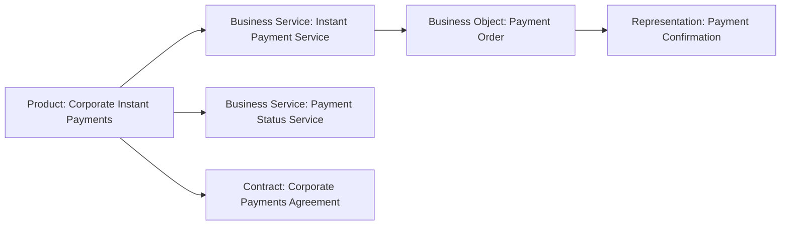

# Business Passive Structure & Product — Object, Representation, Contract et Product

La Business Layer ne décrit pas seulement qui agit et ce que le métier fait. Elle décrit aussi **ce sur quoi le comportement porte**, sous quelle forme l’information est perçue, quels accords encadrent l’échange et quelle offre globale est proposée.

Les concepts principaux sont :

- `Business Object`
- `Representation`
- `Contract`
- `Product`

---

## 1. Business Object

Un **Business Object** représente un concept utilisé dans un domaine métier.

Il répond à :

> **Quelle information ou quel concept métier est manipulé par le comportement ?**

### Exemples MayaBank

- Payment Order
- Customer Account
- Customer Mandate
- Payment Status
- Fraud Case
- Settlement Instruction
- Beneficiary

### Business Object vs donnée technique

`Payment Order` décrit un concept métier.

Une table SQL, un message JSON ou un schéma Avro relèvent d’un niveau plus technique.

On peut donc avoir :

```text
Business Object: Payment Order
Application Data Object: Payment Order Data
Technology Artifact: payment-order.avsc
```

Ces éléments ne sont pas interchangeables.

---

## 2. Business Object vs Data Object

### Business Object

Concept informationnel métier.

### Data Object

Donnée structurée destinée à un traitement automatisé dans l’Application Layer.

Exemple :

```text
Business Object: Customer Mandate
Data Object: Mandate Record
```

Le premier est compris par le métier.
Le second représente la donnée structurée manipulée par les applications.

---

## 3. Representation

Une **Representation** représente une forme perceptible de l’information portée par un Business Object.

Le mot important est **perceptible**.

### Exemples

- Payment Confirmation PDF
- Customer Statement
- SWIFT message displayed as report, selon l’intention du modèle
- Contract Document
- Customer Notification Letter

### Business Object vs Representation

```text
Business Object: Payment Status
Representation : Payment Status Notification
```

Le Business Object est le concept.
La Representation est une forme sous laquelle ce concept devient perceptible.

---

## 4. Representation vs Application Interface

Une Representation n’est pas une interface.

- Representation = forme perceptible d’information ;
- Application Interface = point d’accès à un Application Service.

Un écran peut afficher une Representation, mais l’écran n’est pas automatiquement une Representation dans tous les modèles.

Il faut décider ce que l’on cherche à exprimer.

---

## 5. Contract

Un **Contract** représente une spécification formelle ou informelle d’un accord entre un fournisseur et un consommateur.

Il peut exprimer notamment :

- droits ;
- obligations ;
- conditions ;
- paramètres fonctionnels ;
- paramètres non fonctionnels ;
- règles d’interaction.

### Exemples MayaBank

- Corporate Payments Agreement
- Instant Payment Service Agreement
- Clearing Partner Agreement
- Premium Banking Contract

### Contract vs Requirement

`Requirement` appartient à Motivation.

`Contract` appartient au domaine métier et formalise un accord entre parties.

Exemple :

```text
Requirement: payment service availability must meet target level
Contract   : Corporate Payments SLA Agreement
```

Le premier exprime une propriété nécessaire.
Le second formalise un accord.

---

## 6. Contract vs Business Object

Un Contract est un type spécialisé de passive structure avec une sémantique d’accord.

Un Business Object est plus générique.

Si le modèle veut seulement montrer un concept `Customer Agreement`, Business Object peut parfois suffire.

Si l’important est l’accord entre fournisseur et consommateur, `Contract` est plus précis.

---

## 7. Product

Un **Product** représente une collection cohérente de services et/ou d’éléments passifs, accompagnée d’un Contract ou ensemble d’accords, offerte comme un tout à des clients internes ou externes.

Le mot `Product` est l’un des pièges les plus fréquents pour les architectes IT.

### Product ArchiMate ≠ produit logiciel

Dans ArchiMate :

```text
Product: MayaBank Premium Banking
```

peut inclure :

- Instant Payment Service ;
- Account Management Service ;
- Card Service ;
- Premium Banking Contract.

Ce Product n’est pas l’application mobile.

---

## 8. Product vs Application Component

### Product

Offre métier cohérente au consommateur.

### Application Component

Composant logiciel modulaire et remplaçable.

Exemple :

```text
Product: Corporate Payment Package
Application Component: Payment Orchestrator
```

L’application contribue à délivrer l’offre, mais n’est pas l’offre.

---

## 9. Product vs Business Service

Un Product peut regrouper plusieurs Business Services.

```text
Product: MayaBank Instant Payment Package
├─ Instant Payment Service
├─ Payment Status Service
├─ Exception Support Service
└─ Corporate Payments Agreement
```

Le Service représente un comportement exposé.
Le Product représente l’offre cohérente proposée comme un tout.

---

## 10. Exemple complet MayaBank



Ce diagramme est pédagogique ; les relations ArchiMate exactes seront traitées dans la partie Relations.

---

## 11. Use case : paiement instantané

### Business Objects

- Payment Order
- Debtor Account
- Creditor Account
- Payment Status

### Representations

- Customer Payment Confirmation
- Operations Exception Report

### Contract

- Instant Payment Terms and Conditions

### Product

- Retail Instant Payment Offering

Cette séparation permet de lire clairement :

- ce que le métier manipule ;
- ce que le client voit ;
- quel accord s’applique ;
- quelle offre globale est vendue ou fournie.

---

## 12. Use case : API Banking

Le produit commercial peut être :

`Corporate API Banking Package`

Il peut inclure :

- Account Information Business Service ;
- Payment Initiation Business Service ;
- Reporting Business Service ;
- Corporate API Agreement.

Les API REST elles-mêmes seront décrites dans l’Application Layer comme interfaces/services applicatifs.

Cette séparation évite de confondre **produit métier** et **mécanisme d’intégration technique**.

---

## 13. Anti-patterns

### Anti-pattern 1 — Business Object = table de base de données

Une table est une réalisation technique de données, pas nécessairement le concept métier.

### Anti-pattern 2 — Representation = n’importe quel fichier

La Representation est pertinente lorsqu’on veut exprimer une forme perceptible d’information métier.

### Anti-pattern 3 — Product = microservice

Un microservice est un élément logiciel, pas un Product ArchiMate.

### Anti-pattern 4 — Contract = Requirement

Un Contract formalise un accord entre parties ; un Requirement exprime une propriété nécessaire.

---

## 14. Questions de contrôle

### Q1
`Payment Order` ?

**Business Object.**

### Q2
`Payment Confirmation PDF` ?

**Representation**, si l’on modélise la forme perceptible de l’information.

### Q3
`Corporate Payments Agreement` ?

**Contract.**

### Q4
`Premium Banking` ?

**Product**, si l’on modélise une offre cohérente proposée comme un tout.

### Q5
Pourquoi `Payment Orchestrator` n’est-il pas un Product ?

**Parce qu’il s’agit d’un composant applicatif qui contribue à délivrer l’offre, pas de l’offre métier elle-même.**

---

## À retenir

> **Business Object = concept métier ; Representation = forme perceptible ; Contract = accord ; Product = offre cohérente.**
