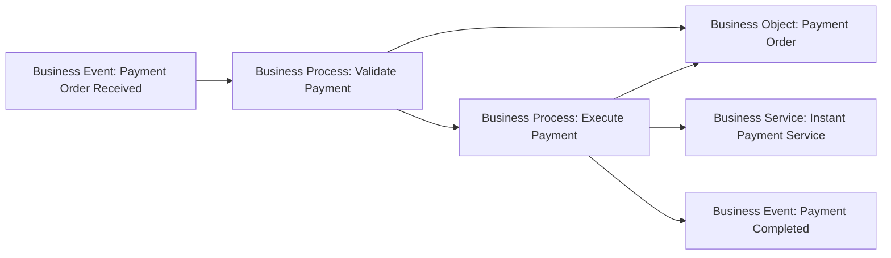

# Business Layer — Patterns de relations et lecture sémantique

Un bon modèle ArchiMate ne juxtapose pas des éléments : il exprime **pourquoi ils sont reliés**.

Ce chapitre présente les patterns de relations les plus utiles pour lire et construire une architecture métier. Les règles complètes de validité et de dérivation seront traitées dans la Partie X — Relations ArchiMate.

---

## 1. Actor / Role : Assignment

Pattern fréquent :

```text
Business Actor
   ── Assignment ──>
Business Role
```

Exemple :

```text
Payments Operations Team
   → Payment Operations Specialist
```

Lecture : l’acteur remplit cette responsabilité.

---

## 2. Role / Behavior : Assignment

Un Role peut être assigné à un comportement qu’il exécute ou dont il porte la responsabilité.

```text
Payment Operations Specialist
   → Resolve Payment Exception
```

Cela répond à :

> **Qui exécute ce comportement ?**

---

## 3. Collaboration / Interaction

Une Business Collaboration peut être assignée à un Business Interaction collectif.

```text
Fraud Investigation Collaboration
   → Joint Fraud Investigation
```

Cela exprime que la coopération de plusieurs participants est responsable de ce comportement collectif.

---

## 4. Process / Service : Realization

Un pattern central est :

```text
Business Process
   ── Realization ──>
Business Service
```

Exemple :

```text
Execute Instant Payment
   → Instant Payment Service
```

Lecture : le comportement interne réalise le comportement exposé.

---

## 5. Function / Service : Realization

Une Business Function peut également contribuer à réaliser un Business Service lorsque l’intention de modélisation porte sur une responsabilité comportementale stable.

Exemple :

```text
Fraud Management
   → Fraud Control Service
```

Le choix Process ou Function dépend donc de ce que le modèle cherche à exprimer.

---

## 6. Interface / Service : exposition

Le Business Interface représente le point d’accès par lequel un Business Service est rendu disponible.

Pattern conceptuel :

```text
Business Interface
   ↔ Business Service
```

Exemple :

```text
Corporate Banking Portal
   exposes
Instant Payment Service
```

L’interface ne remplace pas le service ; elle permet d’y accéder.

---

## 7. Event / Process : Triggering

Un Business Event peut déclencher un comportement métier.

```text
Payment Order Received
   ── Triggering ──>
Execute Instant Payment
```

Le processus peut à son tour produire un autre Event :

```text
Execute Instant Payment
   ── Triggering ──>
Payment Completed
```

Cette lecture est particulièrement utile pour les architectures event-driven.

---

## 8. Process / Process : Triggering

Deux processus peuvent être reliés par un enchaînement causal/temporel.

```text
Validate Payment
   → Execute Payment
   → Settle Payment
```

La relation doit exprimer un véritable déclenchement ou ordre comportemental, pas seulement une dépendance vague.

---

## 9. Flow : ce qui circule

`Flow` met l’accent sur le transfert d’information, de valeur, de matière ou d’éléments entre comportements ou structures actives selon le contexte.

Exemple conceptuel :

```text
Initiate Payment
  -- payment instruction -->
Execute Payment
```

Ne confonds pas :

- `Triggering` = A provoque/ordonne B ;
- `Flow` = quelque chose circule de A vers B.

---

## 10. Behavior / Business Object : Access

Un comportement peut lire, écrire ou modifier un Business Object.

```text
Execute Instant Payment
   -- Access -->
Payment Order
```

Selon le niveau de précision, on peut distinguer la nature de l’accès.

Questions à poser :

- le processus lit-il l’information ?
- la crée-t-il ?
- la modifie-t-il ?

---

## 11. Business Object / Representation : Realization

Une Representation peut représenter la forme perceptible d’un Business Object.

Exemple :

```text
Payment Confirmation
   realizes / represents
Payment Status information
```

Le point important est la distinction sémantique : concept métier vs forme perceptible.

---

## 12. Product / Service / Contract : agrégation d’offre

Un Product regroupe une offre cohérente composée de services et d’éléments associés.

Pattern :

```text
Product: Corporate Payment Package
├─ Instant Payment Service
├─ Payment Status Service
└─ Corporate Payment Agreement
```

La composition/agrégation exacte doit refléter la sémantique du modèle ; elle sera étudiée plus en détail dans la partie Relations.

---

## 13. Serving : qui sert qui ?

La relation `Serving` exprime qu’un élément fournit sa fonctionnalité ou son comportement à un autre.

Exemple cross-layer typique :

```text
Application Service: Payment Orchestration Service
   serves
Business Process: Execute Instant Payment
```

Lecture : le service applicatif soutient le comportement métier.

C’est l’un des ponts les plus importants entre Business et Application.

---

## 14. Cross-layer pattern complet

```text
Business Role
   ↓ Assignment
Business Process
   ↓ Realization
Business Service
   ↑ Serving
Application Service
   ↓ Realization
Application Component
```

Exemple MayaBank :

```text
Payment Operations Specialist
→ Resolve Payment Exception
→ Payment Exception Resolution Service
← Payment Case Management Application Service
← Payment Case Management Component
```

---

## 15. Business Object vers Data Object

Un Business Object peut être réalisé par une représentation structurée au niveau applicatif.

Pattern pédagogique :

```text
Business Object: Payment Order
   ↓ realized/represented in application data
Data Object: Payment Order Data
```

Le modèle montre ainsi le passage du concept métier à la donnée automatisée.

---

## 16. Value Stream vers Business Behavior

La Strategy Layer peut montrer un Value Stream qui est réalisé par des comportements métier.

Exemple :

```text
Value Stream: Deliver Instant Payment
   ↓
Business Processes:
- Capture Payment
- Validate Payment
- Execute Payment
- Confirm Payment
```

Le Value Stream décrit la création de valeur ; les Business Processes décrivent l’exécution opérationnelle.

---

## 17. Capability vers Business Layer

Une Capability peut être réalisée par une combinaison d’éléments :

- rôles ;
- processus ;
- fonctions ;
- applications ;
- ressources.

Exemple :

```text
Capability: Real-Time Payment Processing
realized through:
- Execute Instant Payment Process
- Payment Operations Role
- Fraud Management Function
- Payment Orchestrator Application
```

Cela permet de ne jamais confondre la capability avec un seul composant.

---

## 18. Pattern événementiel MayaBank



Le diagramme aide à lire les concepts. La notation ArchiMate réelle et les relations autorisées seront validées dans les modèles dédiés.

---

## 19. Comment choisir la relation ?

Pose la question en langage naturel.

### « Qui exécute ? »

→ Assignment

### « Qu’est-ce qui réalise ce service ? »

→ Realization

### « Qu’est-ce qui déclenche quoi ? »

→ Triggering

### « Qu’est-ce qui circule ? »

→ Flow

### « Qui utilise quelle information ? »

→ Access

### « Qui fournit son comportement à qui ? »

→ Serving

### « De quoi cet élément est-il constitué ? »

→ Composition/Aggregation selon la sémantique

---

## 20. Anti-pattern : Association partout

`Association` est utile lorsqu’une relation plus spécifique n’est pas appropriée.

Mais elle devient un anti-pattern si elle remplace systématiquement :

- Assignment ;
- Realization ;
- Serving ;
- Access ;
- Triggering ;
- Flow.

Un modèle rempli d’Association perd une grande partie de sa valeur sémantique.

---

## 21. Questions de contrôle

### Q1
Quel type de relation exprime qu’un Business Actor tient un Business Role ?

**Assignment.**

### Q2
Quel type de relation exprime qu’un Business Process réalise un Business Service ?

**Realization.**

### Q3
`Payment Received` provoque `Validate Payment`. Quelle sémantique ?

**Triggering.**

### Q4
Une instruction de paiement circule d’un comportement vers un autre. Quelle sémantique ?

**Flow.**

### Q5
Un processus lit/modifie `Payment Order`. Quelle relation ?

**Access.**

### Q6
Une Application Service soutient un Business Process. Quelle relation est souvent appropriée ?

**Serving.**

---

## À retenir

> **Ne dessine jamais une flèche avant de pouvoir formuler en une phrase ce qu’elle signifie.**
