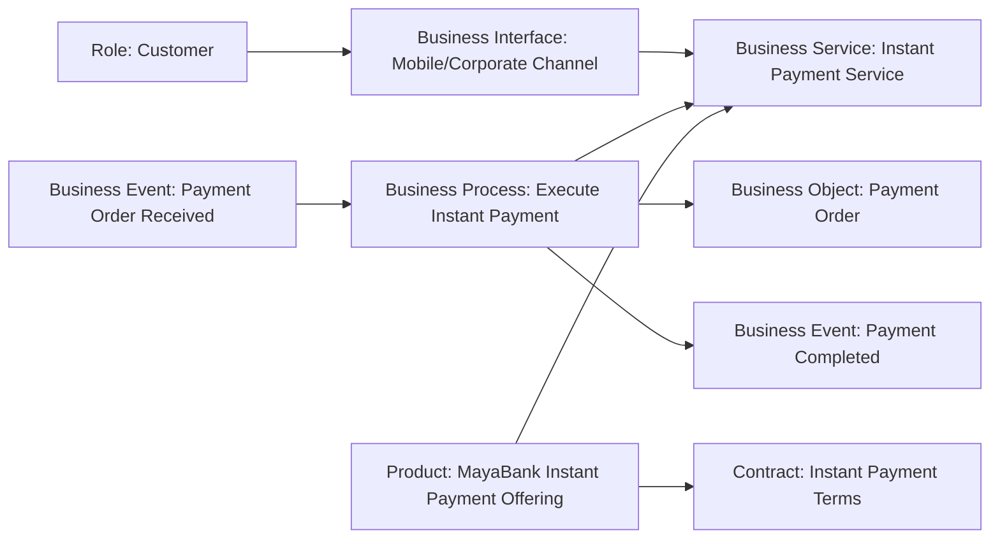
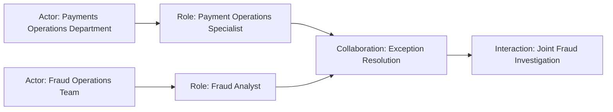

# MayaBank — Business Architecture complète

Ce chapitre assemble les concepts Business Layer dans un cas cohérent de bout en bout.

Le périmètre est la modernisation du **paiement instantané** de MayaBank.

---

## 1. Contexte métier

MayaBank veut fournir un service de paiement instantané :

- disponible 24/7 ;
- traçable de bout en bout ;
- résilient ;
- compatible avec les exigences réglementaires ;
- capable de gérer les exceptions sans dépendre d’un traitement manuel massif.

La Business Architecture doit rester indépendante du choix de Kafka, OpenShift, base de données ou API gateway.

---

## 2. Actors

### MayaBank

Entité métier principale.

### Payments Operations Department

Unité responsable de l’exploitation métier des paiements.

### Fraud Operations Team

Entité spécialisée dans l’analyse des cas suspects.

### Corporate Customer

Organisation cliente utilisant le service.

### External Clearing Partner

Partenaire externe participant au traitement.

---

## 3. Roles

### Payment Initiator

Responsabilité d’initier un ordre de paiement.

### Payment Operations Specialist

Responsabilité de surveillance et résolution d’incidents métier.

### Fraud Analyst

Responsabilité d’analyse des cas suspects.

### Payment Approver

Responsabilité d’autorisation dans les cas nécessitant une validation métier.

### Customer

Rôle de consommateur du service bancaire.

---

## 4. Business Collaboration

`Payment Exception Resolution Collaboration`

Elle regroupe :

- Payment Operations Specialist ;
- Fraud Analyst ;
- éventuellement Compliance Officer.

Elle existe parce que certains cas nécessitent un comportement collectif.

---

## 5. Business Interfaces

### Mobile Banking Channel

Point métier d’accès au service pour le client retail.

### Corporate Banking Portal

Point métier d’accès pour les entreprises.

### Operations Desk

Point métier d’accès pour les opérations internes.

Ces interfaces ne sont pas les API REST techniques sous-jacentes.

---

## 6. Business Events

### Payment Order Received

Déclenche le traitement.

### Fraud Alert Raised

Signale une anomalie nécessitant une action.

### Payment Rejected

Signale un rejet métier.

### Payment Completed

Signale la réussite du paiement.

### Settlement Completed

Signale la finalisation du règlement.

---

## 7. Business Processes

### Initiate Instant Payment

Capture la demande client.

### Validate Payment

Vérifie les éléments requis avant exécution.

### Execute Instant Payment

Produit le résultat métier principal.

### Resolve Payment Exception

Traite les cas nécessitant investigation ou correction.

### Notify Customer

Informe le client du résultat.

---

## 8. Business Functions

### Payment Operations

Responsabilité durable liée à l’exploitation métier des paiements.

### Fraud Management

Responsabilité durable de maîtrise des risques de fraude.

### Customer Relationship Management

Responsabilité métier de relation avec le client.

### Compliance Management

Responsabilité transverse de conformité.

---

## 9. Business Interaction

`Joint Fraud Investigation`

Comportement collectif réalisé par la collaboration Fraud/Operations/Compliance pour certains cas complexes.

Il ne remplace pas le processus global `Resolve Payment Exception` ; il représente une étape collective spécifique.

---

## 10. Business Services

### Instant Payment Service

Service principal consommé par le client.

### Payment Status Service

Permet de connaître le statut d’un paiement.

### Payment Exception Resolution Service

Service métier interne ou exposé à certaines populations selon le modèle.

### Payment Notification Service

Expose le comportement de notification du résultat.

---

## 11. Business Objects

### Payment Order

Concept métier central.

### Debtor Account

Compte débiteur.

### Creditor Account

Compte bénéficiaire.

### Customer Mandate

Mandat ou autorisation métier.

### Payment Status

État métier du paiement.

### Fraud Case

Dossier métier utilisé pendant une investigation.

---

## 12. Representations

### Payment Confirmation

Forme perceptible de l’information de confirmation.

### Exception Report

Forme lisible pour les opérations.

### Customer Statement

Forme perceptible d’informations de compte/paiement.

---

## 13. Contract

`Instant Payment Terms and Conditions`

Il formalise les conditions de l’offre et les engagements associés.

Pour un client entreprise :

`Corporate Payments Agreement`

peut préciser les droits, obligations et niveaux de service.

---

## 14. Product

`MayaBank Instant Payment Offering`

Il regroupe comme offre cohérente :

- Instant Payment Service ;
- Payment Status Service ;
- Payment Notification Service ;
- Instant Payment Terms and Conditions.

Ce Product n’est ni l’application mobile, ni l’orchestrateur de paiement, ni une API.

---

## 15. Vue métier principale



---

## 16. Vue responsabilité



Cette vue permet d’analyser les responsabilités sans parler de logiciels.

---

## 17. Vue processus

```text
Payment Order Received
      ↓
Initiate Instant Payment
      ↓
Validate Payment
      ↓
Execute Instant Payment
      ↓
 ┌───────────────┬─────────────────┐
Payment Completed  Fraud Alert Raised
                       ↓
             Resolve Payment Exception
```

Cette vue reste volontairement architecturale.

Un BPMN pourrait détailler davantage chaque étape si nécessaire.

---

## 18. Vue information

```text
Initiate Payment
  accesses Payment Order

Validate Payment
  accesses Customer Mandate
  accesses Debtor Account

Execute Payment
  updates Payment Status

Resolve Exception
  accesses Fraud Case
  accesses Payment Order
```

Cette vue prépare le passage vers Data/Application Architecture.

---

## 19. Vue Product

```text
MayaBank Instant Payment Offering
│
├── Instant Payment Service
├── Payment Status Service
├── Payment Notification Service
└── Instant Payment Terms and Conditions
```

Cette vue est adaptée à un stakeholder produit ou métier.

---

## 20. Passage Strategy → Business

### Motivation

```text
Goal: Deliver reliable 24/7 instant payments
```

### Strategy

```text
Capability: Real-Time Payment Processing
Value Stream: Deliver Instant Payment
```

### Business

```text
Business Process: Execute Instant Payment
Business Service: Instant Payment Service
Product: MayaBank Instant Payment Offering
```

La chaîne est ainsi traçable depuis l’intention jusqu’au comportement exposé.

---

## 21. Passage Business → Application

La prochaine partie du livre montrera :

```text
Business Process: Execute Instant Payment
↑ served by
Application Service: Payment Orchestration Service
↑ realized by
Application Component: Payment Orchestrator
```

Ainsi, l’application n’est jamais introduite sans expliquer le comportement métier qu’elle soutient.

---

## 22. Baseline MayaBank

### Problèmes

- plusieurs canaux implémentent leurs propres règles ;
- exceptions fortement manuelles ;
- responsabilités parfois ambiguës ;
- statut client fragmenté ;
- plusieurs représentations incohérentes du Payment Status ;
- dépendance forte à des systèmes legacy.

### Business Architecture Baseline

```text
multiple processes
multiple interfaces
duplicated controls
manual exception handling
inconsistent status information
```

---

## 23. Target MayaBank

### Principes métier cibles

- service métier unique d’Instant Payment ;
- processus harmonisé ;
- responsabilités clarifiées ;
- Business Objects communs ;
- gestion d’exception structurée ;
- séparation nette entre service métier et réalisation applicative.

### Target

```text
one coherent Business Service
clear Processes and Functions
stable Business Objects
explicit Roles
standard Product offering
```

---

## 24. Gap Analysis métier

| Baseline | Target | Gap |
|---|---|---|
| règles dispersées | processus harmonisé | rationalisation des règles |
| exceptions manuelles | gestion structurée | automatisation et nouvelle responsabilité |
| statuts fragmentés | Payment Status commun | modèle informationnel commun |
| offre peu lisible | Product explicite | clarification de l’offre |
| responsabilités ambiguës | Roles explicites | gouvernance opérationnelle |

---

## 25. Questions d’architecture que le modèle permet de poser

1. Quel Role est responsable d’une exception ?
2. Quel Process réalise le service Instant Payment ?
3. Quel Product dépend de ce service ?
4. Quels Business Objects sont critiques ?
5. Quelles fonctions métier sont impliquées ?
6. Quels événements déclenchent le traitement ?
7. Quelles applications devront soutenir ces comportements ?
8. Quel impact métier aurait la suppression d’un composant applicatif ?

---

## 26. Exercice

Tu dois supprimer une application legacy.

Ne commence pas par l’application.

Commence par identifier dans ce modèle :

- Business Services concernés ;
- Business Processes dépendants ;
- Business Objects manipulés ;
- Roles responsables ;
- Products impactés.

Puis seulement descendre vers Application/Technology.

---

## À retenir

> **Une vraie Business Architecture ne décrit pas seulement un organigramme ou un processus : elle relie acteurs, responsabilités, comportements, services, informations et offres dans un modèle cohérent.**
