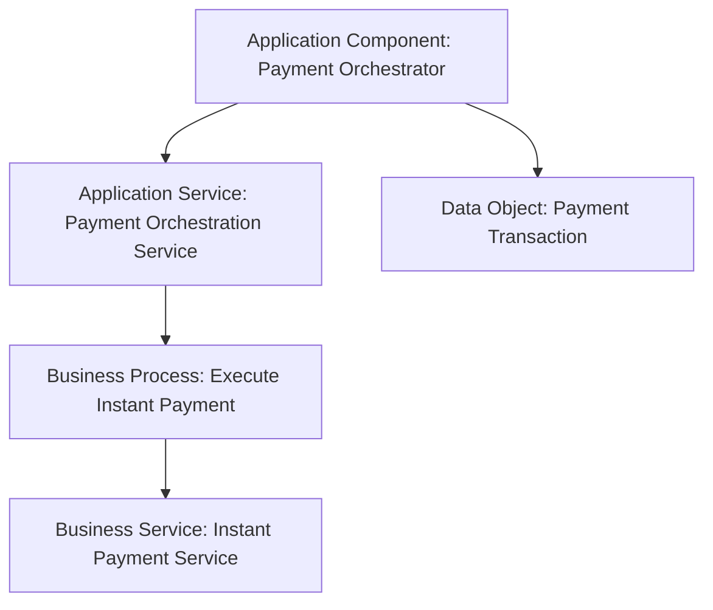

# Partie VI — Application Layer : comment les systèmes supportent le métier

La **Application Layer** décrit les applications, leurs comportements, les services qu’elles exposent, les interfaces par lesquelles ces services sont accessibles et les données qu’elles manipulent.

Elle répond à cinq questions principales :

- **Quel élément logiciel est responsable ?** → `Application Component`
- **Quels composants coopèrent ?** → `Application Collaboration`
- **Par quel point d’accès un service est-il disponible ?** → `Application Interface`
- **Quel comportement applicatif est exécuté ?** → `Application Function`, `Application Process`, `Application Interaction`, `Application Event`
- **Quel comportement est exposé ?** → `Application Service`
- **Quelle donnée structurée est traitée ?** → `Data Object`

---

## 1. La chaîne mentale Application

```text
WHO / WHAT SOFTWARE STRUCTURE?
Application Component / Collaboration
        ↓
WHAT DOES THE SOFTWARE DO?
Function / Process / Interaction / Event
        ↓
WHAT DOES IT EXPOSE?
Application Service
        ↓
WHERE IS IT ACCESSED?
Application Interface
        ↓
WHAT DATA DOES IT USE?
Data Object
```

Cette chaîne sert à comprendre la logique du modèle. Elle ne constitue pas une règle imposant que chaque vue contienne tous les concepts.

---

## 2. Position de la couche Application

ArchiMate distingue clairement le métier de l’application.

### Business Layer

Décrit ce que fait l’entreprise.

Exemple :

```text
Business Process: Execute Instant Payment
Business Service: Instant Payment Service
Business Object: Payment Order
```

### Application Layer

Décrit comment des systèmes logiciels automatisent ou supportent ce métier.

```text
Application Component: Payment Orchestrator
Application Service: Payment Orchestration Service
Data Object: Payment Transaction
```

### Technology Layer

Décrit l’environnement technique nécessaire au fonctionnement de ces applications.

```text
System Software: Kafka Platform
Technology Service: Event Streaming Service
Node: OpenShift Worker
```

La couche Application est donc le pont entre **Business** et **Technology**.

---

## 3. Les éléments Application

### Structure active

- Application Component
- Application Collaboration
- Application Interface

### Behavior

- Application Function
- Application Process
- Application Interaction
- Application Event
- Application Service

### Structure passive

- Data Object

---

## 4. Exemple MayaBank

MayaBank veut moderniser le paiement instantané.

### Components

- Mobile Banking Application
- Payment API Gateway
- Payment Orchestrator
- Fraud Detection Engine
- Limit Management System
- Payment Ledger Adapter
- Notification Service

### Behaviors

- Validate Payment Request — Application Function
- Orchestrate Payment — Application Process
- Fraud Decision Exchange — Application Interaction
- Payment Received — Application Event
- Payment Status Changed — Application Event

### Services

- Payment Initiation API Service
- Fraud Scoring Service
- Limit Verification Service
- Payment Status Service

### Interfaces

- Payment REST API
- Fraud API
- Event Subscription Interface

### Data Objects

- Payment Transaction
- Fraud Assessment
- Customer Limit
- Payment Status
- Clearing Instruction

---

## 5. Application Component : le concept central

Un **Application Component** représente une unité modulaire et remplaçable de fonctionnalité applicative, alignée avec une structure d’implémentation.

Le point important est qu’il représente **une structure logicielle**, pas le comportement exposé lui-même.

Exemple :

```text
Application Component: Payment Orchestrator
```

Ce composant peut réaliser plusieurs fonctions et services.

```text
Payment Orchestrator
  ├─ Validate Payment Function
  ├─ Route Payment Function
  ├─ Payment Orchestration Service
  └─ Payment Status Service
```

### Application Component ≠ Application Service

- Component = structure logicielle
- Service = comportement exposé

### Application Component ≠ Capability

- Capability = aptitude de l’entreprise
- Component = logiciel

### Application Component ≠ System Software

- Application Component = application métier ou applicative
- System Software = logiciel de plateforme/infrastructure

Exemple :

```text
Payment Orchestrator = Application Component
Kafka = System Software
PostgreSQL DBMS = System Software
```

---

## 6. Application Service : ce qui est exposé

Un **Application Service** représente un comportement applicatif explicitement exposé à son environnement.

Exemple :

```text
Payment Orchestrator
    realizes
Payment Orchestration Service
```

Le service peut être consommé :

- par un Business Process ;
- par un autre Application Component ;
- par un rôle métier, selon le niveau du modèle.

### Réflexe

Ne pas confondre le service avec son mécanisme d’accès.

```text
Application Service: Payment Status Service
Application Interface: GET /payments/{id}/status
```

Le service décrit **ce qui est fourni**.
L’interface décrit **le point d’accès**.

---

## 7. Application Interface : point d’accès

Une **Application Interface** représente le point d’accès où un service applicatif est rendu disponible à un utilisateur, un autre composant ou un nœud.

Une interface peut représenter par exemple :

- API REST ;
- API gRPC ;
- interface de messaging ;
- interface utilisateur ;
- port d’intégration logique.

Mais il faut conserver un niveau d’abstraction architectural.

Un endpoint individuel peut être modélisé si c’est pertinent pour le concern, mais ArchiMate n’a pas vocation à remplacer OpenAPI.

---

## 8. Function vs Process vs Interaction

### Application Function

Regroupe un comportement automatisé selon une responsabilité ou une compétence logicielle.

```text
Fraud Detection Function
Payment Validation Function
```

### Application Process

Décrit une séquence de comportements applicatifs produisant un résultat.

```text
Orchestrate Instant Payment
```

### Application Interaction

Décrit un comportement collectif effectué par plusieurs composants.

```text
Payment-Fraud Decision Interaction
```

Le choix dépend donc du **sens architectural**, pas de la taille du logiciel.

---

## 9. Application Event

Un **Application Event** représente un changement d’état applicatif.

Exemples :

- Payment Received
- Fraud Score Produced
- Payment Authorized
- Payment Rejected
- Clearing Response Received

Il est particulièrement utile dans les architectures event-driven.

Mais il ne faut pas confondre :

```text
Application Event: Payment Authorized
Data Object: PaymentAuthorizedEventPayload
```

Le premier représente le **changement d’état**.
Le second représente **l’information structurée** qui peut transporter ou décrire cet événement.

---

## 10. Data Object

Un **Data Object** représente une donnée structurée destinée à un traitement automatisé.

Exemples :

- Payment Transaction
- Customer Profile
- Fraud Score
- Account Balance Snapshot
- Payment Status

### Business Object vs Data Object

```text
Business Object: Payment Order
Data Object: Payment Transaction Record
```

Le Data Object peut **réaliser** le Business Object lorsqu’il constitue sa représentation logique dans le système.

### Data Object vs Artifact

```text
Data Object: Payment Transaction
Artifact: payment_event.avro
```

Le Data Object reste au niveau logique applicatif.
L’Artifact appartient au niveau technologique / réalisation physique ou déployable.

---

## 11. Application Layer et API

Une API peut nécessiter plusieurs concepts selon ce que l’on veut exprimer.

### Si l’on veut montrer la fonctionnalité fournie

```text
Application Service: Payment Initiation Service
```

### Si l’on veut montrer le point d’accès

```text
Application Interface: Payment REST API
```

### Si l’on veut montrer le composant fournisseur

```text
Application Component: Payment Orchestrator
```

Un modèle peut donc contenir les trois :

```text
Payment Orchestrator
      ↓ realizes
Payment Initiation Service
      ↓ exposed through
Payment REST API
```

---

## 12. Application Layer et microservices

ArchiMate peut représenter un microservice comme `Application Component` lorsqu’il constitue une unité applicative modulaire pertinente pour l’architecture.

Mais cela ne signifie pas qu’il faut représenter tous les microservices d’un SI dans toutes les vues.

### Mauvaise vue

100 microservices dans un seul diagramme exécutif.

### Meilleure pratique

Créer des vues adaptées :

- Landscape
- Domain/Application Cooperation
- Integration
- API
- Event-driven
- Migration

Le modèle peut rester détaillé tandis que chaque vue sélectionne seulement les éléments utiles.

---

## 13. Application Layer et Kafka

Kafka ne doit généralement pas être représenté comme Application Component si l’on modélise la plateforme technique elle-même.

Un pattern plus clair est :

```text
Application Component: Payment Orchestrator
Application Event: Payment Authorized
Data Object: Payment Authorized Message
Technology Service: Event Streaming Service
System Software: Kafka
```

Cela maintient la séparation entre :

- comportement applicatif ;
- information ;
- service technologique ;
- technologie de réalisation.

---

## 14. Application Layer et bases de données

Le modèle logique de donnée peut être exprimé avec `Data Object`.

Le moteur PostgreSQL ou Oracle relève plutôt de `System Software`.

Un schéma/table physique peut être représenté par `Artifact` si le niveau technologique est pertinent.

```text
Business Object: Payment Order
        ↓ realized by
Data Object: Payment Transaction
        ↓ realized by
Artifact: PAYMENT_TX table
        ↓ hosted/managed through
System Software: PostgreSQL
```

Cette chaîne distingue clairement les niveaux métier, logique et physique.

---

## 15. Pattern Business → Application



La notation exacte des relations sera détaillée dans la Partie X. Ici, l’objectif est de comprendre le raisonnement : **le métier utilise des services applicatifs réalisés par des composants qui manipulent des données**.

---

## 16. Questions de contrôle

### Q1
`Payment Orchestrator` ?

**Réponse : Application Component.**

### Q2
`Payment Validation` en tant que comportement interne stable ?

**Réponse : Application Function.**

### Q3
`Payment Orchestration API` en tant que fonctionnalité exposée ?

**Réponse : Application Service.**

### Q4
`POST /payments` en tant que point d’accès ?

**Réponse : Application Interface**, si ce niveau de détail est utile à la vue.

### Q5
`Payment Authorized` décrivant un changement d’état ?

**Réponse : Application Event.**

### Q6
`Payment Transaction` en tant qu’information structurée automatisée ?

**Réponse : Data Object.**

### Q7
Kafka ?

**Réponse : généralement System Software lorsqu’on représente la plateforme technique Kafka elle-même.**

---

## À retenir

> **Application Layer = composants logiciels + comportements automatisés + services exposés + interfaces + données.**

La clé consiste à ne pas transformer cette couche en simple inventaire d’applications. Sa vraie valeur vient de la possibilité de montrer **comment les applications supportent le métier, coopèrent entre elles, échangent de l’information et dépendent ensuite de la technologie**.
