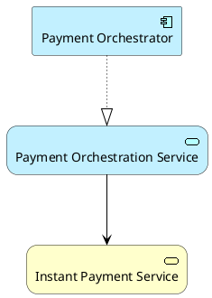

# 2 — Syntaxe ArchiMate-PlantUML

## 2.1 Include standard

```plantuml
@startuml
!include <archimate/Archimate>
@enduml
```

Le fichier `Archimate.puml` de la stdlib PlantUML expose les macros spécifiques ArchiMate.

## 2.2 Exemple minimal



## 2.3 Nommage des identifiants

Le premier argument est l’identifiant technique PlantUML.

Préférer :

```text
CAP_RealTimePayments
BP_ExecuteInstantPayment
AS_PaymentOrchestration
AC_PaymentOrchestrator
TS_EventStreaming
SS_Kafka
N_OCPProd
```

Éviter :

```text
a
b
c
x1
foo
```

Le code doit rester lisible sans le diagramme.

## 2.4 Familles de macros

Exemples courants :

```plantuml
Motivation_Driver(...)
Motivation_Goal(...)
Motivation_Requirement(...)

Strategy_Capability(...)
Strategy_ValueStream(...)
Strategy_CourseOfAction(...)

Business_Actor(...)
Business_Role(...)
Business_Process(...)
Business_Service(...)
Business_Object(...)

Application_Component(...)
Application_Interface(...)
Application_Service(...)
Application_Event(...)
Application_DataObject(...)

Technology_Node(...)
Technology_SystemSoftware(...)
Technology_Service(...)
Technology_Artifact(...)

Physical_Facility(...)
Physical_Equipment(...)

Implementation_WorkPackage(...)
Implementation_Deliverable(...)
Implementation_Plateau(...)
Implementation_Gap(...)
```

Les noms exacts de macros doivent toujours être vérifiés contre la version de bibliothèque utilisée par le projet.

## 2.5 Layout

La bibliothèque fournit notamment :

```plantuml
LAYOUT_LEFT_RIGHT()
LAYOUT_TOP_DOWN()
```

La disposition doit servir le sens de lecture, pas uniquement l’esthétique.

Pour MayaBank :

- Strategy → Business → Application → Technology : souvent haut vers bas ;
- chaînes de migration : souvent gauche vers droite ;
- dépendances techniques : au choix selon densité.

## 2.6 Grouping et nesting

```plantuml
Grouping(G_APP, "Application Layer") {
  Application_Component(AC_PaymentOrchestrator, "Payment Orchestrator")
  Application_Component(AC_Fraud, "Fraud Engine")
}
```

Le grouping est utile pour :

- séparer des concerns ;
- structurer un diagramme ;
- matérialiser une zone logique.

Ne pas utiliser le grouping pour inventer une relation sémantique qui n’existe pas.

## 2.7 Thèmes

Exemple :

```plantuml
!theme archimate-standard from <archimate/themes>
```

Le thème améliore la cohérence graphique. Il ne change pas la sémantique.

## 2.8 Documentation dans le code

Utiliser les commentaires PlantUML :

```plantuml
' Baseline component retained during Transition Plateau P1
Application_Component(AC_LegacyPayment, "Legacy Payment Engine")
```

Les commentaires doivent expliquer le **pourquoi**, pas répéter le nom de l’élément.

## 2.9 Une vue, un concern

Un fichier `.puml` ne doit pas automatiquement contenir tous les éléments du domaine.

Exemple : `SEC-01-payment-identity.puml` ne doit montrer que ce qui aide à répondre aux concerns d’identité, authentication, authorization et secrets.

## 2.10 Règle d’or

> **Un fichier PlantUML est une vue codée, pas la totalité du métamodèle de l’entreprise.**
